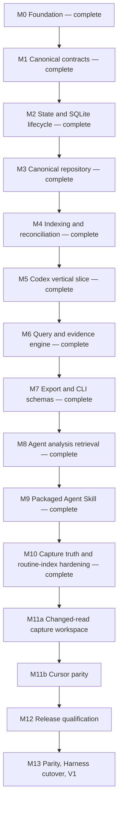

# Sessions V1 implementation roadmap

- Status: active program roadmap
- Date: 2026-07-13
- Last updated: 2026-07-16
- Foundation baseline: PR #1, merged as `601f924`

## Goal

Deliver the accepted standalone Sessions V1: an installable, local-first CLI and
packaged Agent Skill that index Cursor and Codex histories through passive source
adapters, retain the latest successful normalized snapshots in one durable
canonical SQLite library, derive FTS5 search state, and expose equivalent list,
search, show, and portable export semantics without depending on Harness at
runtime.

This roadmap sequences the full program. It is not permission to implement every
milestone in one change. Each numbered milestone becomes a scoped implementation
plan and independently reviewable pull request before work starts. The accepted
[architecture memo](../../docs/architecture-memo.md),
[project intent](../../docs/project-intent.md),
[privacy contract](../../docs/privacy.md), and
[CLI contract](../../docs/reference/cli-contract.md) remain authoritative.

## Current state

Milestones 0 through 10 and M11a are complete. M10 added honest capture scope,
all-tracked reconciliation, bounded source-change retry, opt-in indexing
timings, and a recovery-safe proportional writer-open path. The pre-M11
[Cursor source survey](../../docs/research/cursor-source-survey.md) found that
current WAL-backed Cursor stores need the existing private capture workspace
during changed reads. M11a completed that provider-neutral prerequisite; M11b
adds Cursor parity next.
The repository now includes:

- compiled TypeScript/ESM package delivery with a `sessions` binary;
- strict dependency, format, lint, type, test, build, dist, and packed-install
  gates behind `pnpm check`;
- cross-platform CI and dependency updates;
- hardened provider-neutral session/source contracts and conformance fixtures;
- platform-local Sessions state resolution plus non-mutating `paths` reporting;
- a real, read-only `doctor` command for Node, SQLite/FTS5, and index state;
- an internal protected SQLite writer lifecycle with checksummed migrations;
- an atomic provider-neutral canonical repository with collision-safe content,
  last-good freshness state, bounded run diagnostics, and derived FTS data;
- an internal provider-neutral indexing service with complete-discovery admission,
  incremental reads, last-good preservation, all-tracked exact-source
  reconciliation, bounded source-change recovery, and repository-authoritative
  reports;
- renewable writer leases, transactional mutation fencing, abandoned-run
  interruption, valid WAL recovery, exact-generation clean sealing, and a
  private stat-bound post-close proof;
- internal only-owned-file clear/repair/compact maintenance and immutable
  ready-index health inspection used by doctor;
- one current storage baseline with durable canonical evidence, exact text,
  privacy-safe omissions, incremental whole-page reclamation, generic tool
  identity/linkage, capture time, and source-presence state;
- one closed public session-document projection, fragment-fed RFC 8785/JCS
  digest, atomic digest/body persistence, canonical verification, and required
  same-snapshot retained attribution;
- one shared bounded/full public transcript selection plus closed schema-1 JSON
  and independently attributable JSONL for list, search, entries, show, and
  export;
- a passive Codex adapter that snapshots the required state database/WAL into a
  leased private workspace, streams plain or Zstandard rollouts, and normalizes
  source evidence without writing provider-owned files;
- public `index`, `list`, `search`, `entries`, `show`, `export`, `forget`,
  `data repair-orphans`, `data compact`, and `data clear` workflows
  backed only by the provider-neutral application and storage layers;
- filtered/cursored retained-session list plus literal lexical search over one
  immutable canonical-library snapshot, with provider-neutral query values and
  no adapter reads;
- deterministic entry-level ranking, bounded adjacent/direct tool context,
  query-wide occurrence/content/root/unknown-lineage support, and opaque cursors
  bound to query, library identity, and writer generation;
- literal all/any search with bounded admission and per-hit matched terms,
  shared exclusive activity bounds, and query-derived roots on list, search, and
  entries;
- one packaged Sessions Agent Skill with a shared evidence protocol and seven
  routed playbooks for context, retrospectives, preferences, workflow and
  verification audits, handoffs, and capability discovery;
- explicit complete/unknown lineage coverage, Codex `codex-v3` evidence, and a
  query-scoped iterative provider-neutral root resolver;
- proportional changed-document/FTS proof on clean index generations,
  canonical-only FTS projection repair after uncertain opens, and immutable
  semantic FTS verification in doctor;
- aggregate orphan-content reachability in doctor plus explicit provider-free,
  fixed-batch canonical orphan deletion under dedicated repair ownership;
- platform application-data storage, non-destructive missing/unknown source
  reconciliation, scoped deletion, and source-aware paths/doctor reports;
- accepted architecture, privacy, CLI, adapter, and contributor contracts.

It does not yet have the Cursor adapter, release automation, or pinned Harness
integration. M11b now proves the complete provider-neutral surface through a
second passive adapter.
Markdown presentation is deferred beyond V1; JSON and JSONL are the portable
machine formats for V1.

## Execution rules

1. One milestone, one scoped executor plan, one primary pull request. Split a
   milestone only when reviewability requires it; do not combine adjacent
   milestones to save process.
2. Run the plan reviewer for every non-trivial executor plan. Run `pnpm check`
   and the repository change-review workflow before merging implementation.
3. Keep generated help and user docs honest: add a command only when its complete
   path and contract tests work.
4. Use synthetic fixtures and temporary roots. Never commit personal transcripts,
   provider databases, machine paths, or secrets.
5. Runtime commands remain offline and telemetry-free. Provider inputs are opened
   read-only. Only explicit indexing creates or migrates persistent state.
6. Every state boundary proves success, malformed input, partial failure,
   interruption, and retry behavior at the highest stable test seam.
7. Any new production dependency needs a concrete runtime benefit, package-impact
   review, and an equivalent-dependency check. Native Node APIs remain preferred.
8. Update current-versus-planned docs in the same pull request as behavior.
9. Treat canonical snapshots as durable user data. Provider disappearance,
   projection rebuild, or migration never implies permission to delete them;
   canonical deletion remains an explicit user operation.

## Post-M9 dogfood evidence and accepted direction

A real-library comparison after M9 confirmed that the standalone model is
stronger than the Harness metadata cache for durable, reproducible evidence. It
also exposed three gaps that must be settled before the second adapter proves
the core contract:

- A candidate that changes during its first read correctly fails as
  `source-changed`, but indexing records that terminal outcome without one fresh
  retry. An existing last-good snapshot remains queryable as stale; a first-read
  failure has no canonical document and remains unindexed.
- At that baseline, list, search, and entries described retained matches but
  could not tell an agent
  that tracked sessions were discovered and never captured. A no-hit result can
  therefore look more complete than the retained evidence warrants.
- Complete-scan reconciliation then considered only identities with a canonical
  document. An unindexed tracking row could remain marked present after a later
  complete scan no longer observed it.

The same comparison measured an almost entirely unchanged real library taking
nearly two minutes to index. The code avoids transcript reads for unchanged
candidates, but still performs discovery, per-candidate freshness reads and
immediate tracking transactions, writer-open validation/FTS inspection, and
final reconciliation. M10 therefore instrumented the complete path before
selecting an optimization. Synthetic millisecond query benchmarks remain
algorithm checks, not proof of real-library latency.

Other observations do not overturn the architecture:

- A larger standalone database is expected because it retains normalized text
  and FTS instead of reopening provider files. Aggregate inspection found no
  material free-page leak, and the retained library remained substantially
  smaller than the provider history it represented.
- Rejecting a changing input is required to avoid a mixed-generation document.
  The gap is bounded recovery, not weaker mutation checks.
- Last-good preservation already works. Only a session that has never completed
  one successful capture lacks queryable evidence.
- `--match all` means all tokenizer terms, not an adjacent phrase. Additional
  matches are expected under that contract.
- Canonical UTC bounds and cursor-bound exact filters remain deliberate
  reproducibility choices. Human time shortcuts are not part of M10.

Accepted M10 direction:

- reconcile complete discovery against every tracked identity while preserving
  unindexed failure evidence and allowing the honest orthogonal state
  `unindexed + missing`;
- add aggregate capture scope to list/search/entries page output and global
  doctor details without claiming an unindexed session matched or failed a
  canonical metadata, entry, or text filter;
- perform at most one fresh rediscovery per source when the primary pass has
  `source-changed` candidates, retry only those original identities, and keep
  primary discovery as the sole coverage and missing-reconciliation snapshot;
- add opt-in, privacy-safe phase timings, then optimize only the measured stable
  indexing bottleneck while preserving exact results and lifecycle behavior.

The implementation baseline identified that bottleneck. A deterministic
2,000-session stable run took 532.902 ms: writer open 282.069 ms, unchanged
writes 174.950 ms, freshness reads 40.271 ms, and close 21.884 ms. The authorized
real Codex check indexed a fixed 120-session disposable cohort, then measured a
fully unchanged 3,553.177 ms run: writer open 3,177.450 ms, discovery 354.958 ms,
freshness reads 3.072 ms, unchanged writes 11.863 ms, and close 3.542 ms. Exact
control/timed semantics, selected observations and rollout bytes, library health,
and zero changed reads all passed. These machine-local values are design
evidence, not public guarantees. The completed clean-generation path reduced the
same fixed synthetic proof to 2.767 ms writer open / 264.666 ms total. An
authorized read-only real Codex 120-session exact-cohort proof used 3.262 ms /
366.055 ms with zero changed reads. Both budgets and exact semantic comparisons
passed. Per-candidate batching remains unjustified by this evidence.

Near-term candidates remain evidence-gated rather than M10 commitments:

- tokenizer-adjacent phrase search, explicitly distinct from byte-exact segment
  containment;
- a lower title bound for search and entries if representative payload
  measurements confirm material encoded-output savings;
- exact provider-neutral locator-string interning if distinct-count and database
  measurements justify a schema and join cost. The observed repeated locator
  bytes make this credible, but retained canonical text and FTS are expected
  storage rather than leaks.

After V1, the preferred core direction remains deterministic evidence primitives:
related-session traversal, literal metadata discovery, explicit multi-session
JSON/JSONL bundles with reproducibility manifests, exact named-unit facets,
cross-session comparison/timelines, machine-readable capability discovery, and
a canonical archive whose import/restore semantics are designed separately.
Semantic relevance, causality, success/failure, drift, preferences, and workflow
recommendations stay in the Agent Skill rather than the core engine.

## Dependency map



Codex is intentionally first. Its state/rollout split, namespaced tools,
non-text records, and structural lineage force the generic model to prove its
assumptions before the query/export and Agent Skill contracts stabilize. M8 and
M9 complete that provider-neutral evidence workflow over Codex. M10 uses real
dogfood evidence to settle capture-scope truth, bounded source-change recovery,
and routine indexing cost. The second real adapter then proves one missing
provider-neutral capture capability: changed reads need the same leased private
workspace already used by discovery. M11a makes that capability explicit before
M11b adds Cursor without provider-specific changes to domain, storage, query,
export, CLI semantics, or skill playbooks.

## Milestones

### M0 — Foundation (complete)

Outcome: honest pre-alpha repository, architecture baseline, executable doctor,
and robust local/CI gates.

Evidence: existing `src/`, `test/`, `.github/`, package scripts, contracts, and
the merged initial scaffold. The completed scaffold plan is removed from the
active plan directory; Git history remains its archive.

### M1 — Harden canonical contracts and source conformance (complete)

Outcome: one stable internal vocabulary that storage, indexing, and every adapter
can implement without provider cases.

Primary change areas:

- `src/domain/session.ts` and focused identity, content-hash, provenance, and
  lineage modules under `src/domain/`;
- `src/application/ports/session-source.ts` and typed source failures under
  `src/application/`;
- reusable adapter conformance helpers under `test/contracts/` and synthetic
  provider fixture builders under `test/fixtures/`.

Required decisions and behavior:

- Replace the single discovered-session locator with ordered input descriptors.
  Each input has an opaque diagnostic locator and fingerprint; the candidate has
  one aggregate fingerprint covering every input consumed by `read()`.
- Require adapters to verify live candidate inputs while reading or consume a
  complete frozen discovery snapshot for snapshot-owned inputs. A changed live
  input or stale frozen descriptor is a typed `source-changed` failure, never a
  partially normalized document.
- Add typed unavailable, unreadable, malformed, source-changed, and unsupported-
  format failures with safe diagnostics that do not include transcript text.
- Let probe results expose sanitized resolved source roots for `sessions paths`;
  path resolution remains adapter-owned and never reads transcript content.
- Define and round-trip one escaped printable identity grammar for adapter kind,
  source instance, and opaque native ID before the value enters storage or JSON.
- Make content hashing core policy, not adapter policy. V1 uses versioned SHA-256
  over the exact UTF-8 canonical segment text; hash collisions never merge
  unequal text.
- Validate ordinals, relation targets, timestamps, actor/origin values, and
  deterministic ordering at the application boundary. Missing evidence maps to
  absent or `unknown`, never inference.
- Define one occurrence as one canonical content segment at one entry/segment
  ordinal. Exact equal text does not, by itself, prove copied/replayed origin.
- Keep the port internal. Do not add adapter discovery, plugin loading, or a
  public library export.

Exit gate:

- A synthetic source passes the shared conformance suite for non-mutating probes,
  deterministic discovery/read, complete fingerprint invalidation, source change
  during read, missing optional metadata, stable ordering, malformed inputs,
  unknown provenance, and generic adapter kinds.
- Identity and hash codecs have focused round-trip and adversarial-input tests.
- `pnpm check` passes.

### M2 — Add state paths, SQLite lifecycle, and privacy controls (complete)

Outcome: Sessions can explain and safely initialize its own rebuildable state,
without yet implementing repository behavior.

Primary change areas:

- `src/domain/index-state.ts`;
- `src/application/get-paths.ts` and an index-lifecycle port under
  `src/application/ports/`;
- `src/infrastructure/state/paths.ts`;
- `src/infrastructure/sqlite/database.ts`, `migrations.ts`, `permissions.ts`, and
  migration modules;
- `sessions paths`, composition wiring, and SQLite lifecycle integration tests.

Required decisions and behavior:

- Resolve a Sessions-specific platform cache directory: XDG cache on Linux,
  `Library/Caches` on macOS, and `LOCALAPPDATA` on Windows. The explicit
  `SESSIONS_CACHE_DIR` override selects the owned directory for tests and advanced
  use. Never reuse or auto-migrate the legacy Harness JSONL cache.
- `sessions paths [--format human|json]` initially reports only Sessions-owned
  index/state locations plus initialized state without creating directories or
  files. Registered adapters extend it with their own source roots in M5 and
  M11b.
- Only explicit `sessions index` opens a writer that creates state or applies
  migrations. Read commands report missing or incompatible state with a concise
  remediation path; they do not silently initialize or rebuild it.
- Use ordered, checksummed, forward-only migrations. Apply each release migration
  transactionally, refuse a database from a newer schema, and leave a failed
  migration recoverable.
- Writer connections enable foreign keys, WAL, a bounded busy timeout, SQLite
  `secure_delete`, and FTS5 secure-delete when supported. Unsupported FTS secure
  deletion is reported honestly rather than treated as encryption.
- Create POSIX owned directories as `0700` and constrain database, WAL, and SHM
  files to `0600`; use the current user's profile-local state and platform ACLs
  on Windows.
- Extend doctor non-mutatively for resolved-path safety and compatibility. An
  uninitialized index is healthy with guidance, not an error.

Exit gate:

- Path-resolution tests cover supported operating systems, missing environment
  values, the explicit override, state-only output before adapters, and no state
  creation from `paths` or `doctor`.
- SQLite tests cover fresh create/reopen, ordered migrations, injected rollback,
  newer-version refusal, foreign keys, FTS5, pragmas, and effective POSIX modes.
- Tests prove lifecycle code never opens provider histories for writing.
- `pnpm check` passes on all CI operating systems.

M2 records the implemented pre-public cache lifecycle. M5 supersedes its path and
rebuildability assumptions by moving canonical data to platform application data;
the completed M2 evidence remains historical implementation truth.

### M3 — Implement the canonical repository and query-ready schema (complete)

Outcome: one provider-neutral repository can atomically persist and reconstruct a
complete canonical document while retaining the state needed for incremental
indexing, last-good behavior, recurrence, and future search.

Primary change areas:

- `src/application/ports/session-index.ts`;
- `src/application/validate-session.ts`;
- the initial canonical migration under `src/infrastructure/sqlite/migrations/`;
- `src/infrastructure/sqlite/sqlite-session-index.ts`;
- repository integration and round-trip fixtures under `test/infrastructure/`.

Initial schema responsibilities:

- migration metadata, source instances, index runs and run items;
- sessions and provider-neutral relations;
- ordered entries;
- collision-safe content values with stable integer identity, compact fixed-scheme
  digest buckets, and exact binary text equality guarded at canonical insertion;
- content occurrences retaining session, entry, segment ordinal, actor, origin,
  confidence, timestamp, and diagnostic source metadata;
- an external-content FTS5 table maintained as derived search state.

Repository behavior:

- Expose business values only—no SQL, FTS, Cursor, or Codex vocabulary in the
  application port.
- Retain last-good indexed fingerprint/version/document separately from the latest
  discovered fingerprint/version/error. A refresh failure marks an indexed
  session stale without replacing canonical content.
- Replace one session document and its FTS rows atomically. Rollback restores the
  complete previous document.
- Reconstruct list summaries and full canonical documents only from the index.
- Keep run diagnostics bounded by an explicit retention policy in the scoped
  plan; transcript content is not retained merely for diagnostics.
- Parameterize all SQL and preserve source-instance isolation when native IDs
  collide.

Exit gate:

- Exact canonical round-trip, atomic replacement, forced rollback, cascade/FTS
  consistency, collision safety, source-instance isolation, and last-good/stale
  state tests pass.
- A repository contract suite passes against SQLite without provider branches.
- `pnpm check` passes.

### M4 — Build indexing, reconciliation, maintenance, and writer safety (complete)

Outcome: a provider-neutral application service owns the complete indexing
lifecycle before any concrete provider is wired.

Primary change areas:

- `src/application/run-index.ts`, validation, reports, and operational errors;
- source-selection and index-lifecycle application values;
- `src/application/clear-index.ts`;
- state-aware SQLite diagnostics and writer coordination;
- fake-source/index integration tests.

Index sequence:

1. Resolve explicitly selected source instances and run their probes.
2. Start an inspectable run for one source instance.
3. Complete discovery, tracking whether iteration ended normally.
4. Compare identity, aggregate input fingerprint, and adapter version.
5. Skip unchanged candidates without calling `read()`.
6. Read and validate changed candidates, then atomically replace each session.
7. Reconcile unseen sessions only after a complete discovery for that exact
   source instance.
8. Finish with discovered, unchanged, updated, failed, missing, stale, and
   incomplete counts plus bounded item diagnostics.

Failure and concurrency policy:

- Failed reads preserve prior canonical rows and record staleness. A new failed
  candidate records diagnostics but no document.
- A thrown or incomplete discovery proves no absence. A complete later scan marks
  missing canonical documents without deleting them.
- Two indexing writers cannot mutate the same index concurrently. The second
  exits with an operational diagnostic; a later run identifies and closes an
  interrupted predecessor safely.
- The internal clear service removes only the known Sessions database and
  sidecar files. Missing state is success. An active/locked index is refused;
  the cache root and provider files are never recursively deleted. At M4
  completion this was intended to back `sessions index clear`; ADR 0007 now
  reserves it for explicit all-data deletion after the path transition.
- State-aware doctor reports incompatible schema, unsafe modes, integrity/FTS
  failure, secure-delete support, and interrupted runs without mutating state or
  content timestamps.
- Do not expose `sessions index` in generated help until M5 registers a real
  source.

Exit gate:

- Fake sources prove unchanged skip, adapter-version invalidation, idempotence,
  discovery-order independence, last-good preservation, source-changed handling,
  incomplete-scan no-delete, complete-scan removal, interrupted-run recovery, and
  two arbitrary adapter kinds without engine edits.
- Clear application/infrastructure tests cover absent state, only-owned-file
  deletion, locked refusal, and stable structured reports. Doctor CLI tests
  cover streams and exit codes. The originally planned `sessions index clear`
  registration is superseded by M5 forget/data-clear behavior.
- `pnpm check` passes.

M4 records the implemented pre-public reconciliation and maintenance behavior.
M5 replaces complete-scan deletion with retained source-presence state, replaces
public `index clear` with explicit forget/data-clear intent, and keeps the M4
writer safety and only-owned-file guarantees.

### M5 — Ship the Codex vertical slice (complete)

Outcome: the first end-to-end user workflow durably captures Codex and serves
list/show from the canonical library even after later provider disappearance.

Primary change areas:

- the provider-neutral entry contract, validation, SQLite migration, repository
  round trip, durable capture/source-presence state, and generic tool/non-text-
  evidence fixtures;
- `src/adapters/codex/source.ts`, `paths.ts`, `state-db.ts`, `rollout.ts`,
  `normalize.ts`, `fingerprint.ts`, and `lineage.ts`;
- Codex synthetic state/rollout fixtures, golden tests, and the shared source
  contract;
- application services for list/show;
- application services for non-destructive absence reconciliation, one-session
  forget, and all-data clear;
- modular CLI commands/renderers, application-data paths, doctor/paths updates,
  and composition registration;
- a documented Codex format-support matrix grounded in the
  [source survey](../../docs/research/codex-source-survey.md).

Required behavior:

- Move canonical storage from the pre-public cache to platform application data:
  XDG data on Linux, `Library/Application Support` on macOS, and
  `LOCALAPPDATA` on Windows. Replace `SESSIONS_CACHE_DIR` with the absolute
  `SESSIONS_DATA_DIR` override and use `sessions.sqlite3`; never silently import,
  delete, or reuse the old cache or Harness JSONL state.
- Define one current pre-alpha storage baseline containing capture time,
  last-seen/source-observation time, source presence (`present`, `missing`, or
  `unknown`), adapter version/source revision, canonical evidence, FTS, run
  diagnostics, and writer coordination directly. Earlier development databases
  are unsupported and fail closed without migration or deletion. Snapshot
  freshness and source presence remain independent. The completed M7 foundation
  adds the exact public projection and document-digest scheme directly to the
  single current baseline; there is no pre-launch backfill.
- Use one application-owned observation instant per selected-source run for its
  coverage, presence, last-seen, and successful-capture facts. Capture time means
  the scan that produced the successfully persisted normalized snapshot. SQLite
  lease/recovery time populates only coordination and interrupted-run diagnostics.
- Adapt indexing so discovered candidates become present, a typed read failure
  preserves the latest successful snapshot as stale, and only a successful
  complete scan marks an unseen retained session missing. Unavailable,
  unreadable, malformed, or incomplete discovery proves no absence. Reappearance
  restores present and unchanged fingerprints still skip `read()`.
- Retain only the latest successful normalized snapshot per canonical identity in
  V1. No TTL, pruning, raw-provider backup, or immutable revision history is
  introduced.
- Expose `sessions forget <canonical-id>` for one retained copy and
  `sessions data clear --yes` for the known Sessions database/WAL/SHM files and
  exact Sessions-owned ephemeral scratch subtree.
  Forget removes selected tracking/owned canonical evidence and redacts its
  historical run-item details while preserving aggregate run diagnostics,
  shared content, and incoming relation references owned by other snapshots.
  Neither command touches provider histories; a later index can recapture a
  forgotten session that the provider still exposes. Do not publish
  `sessions index clear`.
- Clear removes scratch under active heartbeat after the destructive-intent
  boundary, then refreshes/asserts ownership, checkpoints, closes without
  release, and verifies post-close database/sidecar identities and the immutable
  owned lease immediately before unlink. It refuses orphan scratch without a
  lease-bearing database and reports `scratchRemoved` separately.
- Add `forget` to the fenced writer lease. Every live purpose is exclusive;
  expired index/forget may be taken over by any writer, while an expired clear
  may be resumed only by clear because file unlink continues after database
  close. Doctor reports `forget-live` distinctly and active runs are healthy only
  beside `index-live`.
- Keep the ordered, checksummed migration ledger for future published releases.
  Index may bootstrap only a truly empty owned database; forget never initializes
  storage, and clear accepts only the current baseline or an empty interrupted-
  initialization file without recovery state. All unsupported schemas fail closed.
- Publish one current M5 operational schema version: index with source coverage,
  `missing`, and full canonical identity refs; forget/data-clear; paths with
  durable-library and sanitized probe outcomes; doctor
  with `library-state`, `source-codex`, canonical-versus-FTS health, remediation,
  and lease state. M7 now owns transcript/query/export DTOs.

- Before Codex normalization depends on it, extend the generic entry model and
  storage projection with `tool-call`/`tool-result` kinds, an optional exact
  source-observed `toolName` and, only when a name exists, an optional exact
  source-observed `toolNamespace` on calls, provider call IDs, canonical entry
  linkage, and faithful ordered argument/result text. Tool name and namespace
  remain separate, case-sensitive fields. Results link to calls without
  receiving copied identity. This is generic tool evidence, not a skill-specific
  analytics model.
- Make canonical content an ordered union of text and omitted segments. Text
  segments retain exact text and hashes and alone enter FTS, deduplication, and
  recurrence measures. Omitted segments retain position, broad content class,
  provenance, and a 1–64-byte lower-ASCII kebab source type matching
  `^[a-z0-9]+(?:-[a-z0-9]+)*$` without bytes, data URLs, remote URLs, local paths,
  placeholder text, or hashes. Domain/storage admission preserves the exact
  token. Adapters use fixed format labels or a narrowly admitted structural
  discriminator with a fixed fallback, never arbitrary payload content. Defer
  OCR, media interpretation, and attachment storage.
- Implement against the upstream format and new fixtures. Reuse only proven
  Harness reference behavior for home/state lookup, read-only row access, and
  conservative adjacent paired-record deduplication. Do not port whole-file
  parsing, flattened tool text, preamble stripping, provider-owned caches,
  analysis/classification policy, or source-reopening queries.
- Resolve `CODEX_HOME`, top-level global `config.toml` `sqlite_home`, and
  `CODEX_SQLITE_HOME` with official precedence, using a real TOML parser rather
  than regex. Select root `state_5.sqlite`; allow the legacy nested fallback only
  when neither config nor environment selected a root and the current root is
  absent. Never merge roots or fall back from an explicit missing/corrupt store.
  Document V1 as the global/default Codex instance; full profile/project/runtime
  config-layer parity and explicit multiple instances are later work.
- Derive a stable source instance from resolved roots. Accept only regular
  rollout filenames whose thread ID matches and whose canonical path remains
  under Codex `sessions` or `archived_sessions`; reject traversal, symlink
  escape, and unrestricted absolute paths. Normalize plain/compressed files to
  one logical identity and prefer plain if both exist.
- Domain-separate the source instance with the exact role-tagged JSON tuple
  `sessions-codex-source-instance-v1`, resolved Codex home, and resolved SQLite
  home; hash its unspaced UTF-8 serialization with SHA-256. A golden digest locks
  this persistent identity preimage.
- Treat the state database as required discovery and the referenced rollout as
  content authority. Do not silently fall back to a filesystem scan. Never give
  SQLite a provider path. Copy a pre/post-verified stable database/WAL byte set
  from the same read-only filesystem handles into random children created by a
  provider-neutral private-directory capability backed by the exact permission-
  restricted Sessions-owned `.scratch` path; open only that copy
  read-only/query-only and feature-detect optional columns. Provider SHM is never
  opened, copied, or used to gate capture. Materialize one immutable row/edge
  generation per discovery and remove staging before yielding candidates;
  candidate reads never recopy or reopen state. The index writer sweeps stale
  scratch only after exclusive lease acquisition, writer close attempts removal
  before lease release, and data clear owns crash residue. Exhausted database/WAL
  stability retries make discovery incomplete and preserve retained state. The
  adapter never receives `IndexPaths` or resolves application-data paths.
- Fingerprint the whitelisted logical thread row, its parent-edge row or explicit
  absence, and the selected rollout independently. Candidate read requires a
  matching frozen discovery generation and verifies the live rollout before and
  after streaming. Later state changes appear on the next discovery; a stale
  candidate or live rollout representation/value change is `source-changed` and
  cannot replace the last-good document.
- Stream both `.jsonl` and `.jsonl.zst` with bounded per-record memory using the
  supported Node runtime. Handle a plain/compressed representation transition
  safely; never load a complete rollout into memory.
- Preserve user/assistant/developer/system text and the M5 matrix's exact
  base/legacy injected fields with evidence-backed provenance. Collapse only
  recognized adjacent duplicate event/response messages. Preserve same-source
  and non-adjacent repeats.
- Fully map function/custom calls and results with exact call IDs, namespaces,
  non-adjacent linkage, ordered supported outputs, and unmatched evidence without
  fabricating status. Route the matrix's exact local-shell, dynamic/MCP,
  tool-search, web-search, image-generation, exec, patch, view-image, review,
  collaboration, and sub-agent discriminators through privacy-safe unknown
  evidence in M5; later format increments may interpret them. Catalogs, requests,
  and model declarations do not prove invocation.
- Use `thread_spawn_edges` and explicit session metadata for lineage. A child
  receives the exact parent relation; do not synthesize reciprocal edges or
  infer forks/replay from equal text. Preserve explicit inter-agent content and
  delegated/replayed origin only where its boundary is provable.
- Normalize task/turn, compaction, rollback, and abort records as lifecycle
  markers. Completion is not success. Preserve explicitly visible reasoning
  summaries; omit encrypted/hidden reasoning, world state, ghost snapshots, and
  unsupported opaque payloads according to the support matrix.
- Register Codex only in `src/bin/sessions.ts`. Expose working
  `index --source codex`, provider-neutral `list`, and index-only `show` with
  bounded output, canonical IDs, capture time, source presence, and freshness.
  Extend `sessions paths` with the versioned durable-library report and sanitized
  Codex roots supplied by the adapter's probe result. Doctor distinguishes
  canonical-library integrity from rebuildable FTS integrity.
- Treat list on an uninitialized library as an empty successful read without
  opening/creating state or resolving Codex; initialized non-ready states still
  fail, and show of an absent identity remains not-found.

Exit gate:

- Domain, validation, migration, and repository tests round-trip generic linked
  tool calls/results, separate optional name/namespace, and ordered omitted
  content. Tests prove omitted segments never enter FTS, hashes, recurrence, or
  output as private references. Boundary and adversarial tests enforce the exact
  source-type grammar and prove unsafe discriminators fall back without leaking.
- Schema/repository/application tests prove one-row baseline bootstrap, obsolete-
  development-schema refusal without mutation, deterministic present/missing/
  unknown transitions, complete-scan retention,
  incomplete-scan no-absence, idempotent repeated missing state, unchanged and
  changed reappearance, and present-plus-stale read failure. Divergent app/lease
  clocks prove one application-owned scan instant populates library facts.
- Lease tests prove every live/expired arbitration cell, expired-clear recovery,
  stale-owner fencing, and forget crash/idempotence. Exact structured-report
  tests cover all operational schemas, probe unions, doctor order/details, and
  the current failed/missing outcome set. A source-instance golden vector plus path
  alias/root isolation tests lock the persistent Codex identity.
- Lease tests prove live refusal is mutation-free, expired takeover fences every
  prior owner, and synthetic future migrations run only under owned writer
  identity. Fresh-root list tests prove exact empty output, exit/stream behavior,
  and no storage/provider activity.
- Codex passes shared conformance and provider golden tests for root/environment/
  config/legacy paths, explicit missing/corrupt roots, required and optional
  schema fields, path containment, logical row/edge
  fingerprints, plain/Zstandard rollouts, representation changes, malformed and
  unknown records, stable ordering, and read-only operation.
- The format matrix and fixtures cover every exact supported, deferred, skipped,
  aliased, nested, malformed, and unknown treatment; adjacent paired messages;
  same-name tools in multiple namespaces; function/custom and structured results;
  non-adjacent and unmatched calls/results; injected content;
  text-image-text ordering; parent, missing-parent, replay ambiguity, inter-agent
  content; compaction, rollback, abort, and task completion; visible versus
  hidden reasoning; and deferred execution evidence.
- An end-to-end temporary-home test indexes, lists, and shows. Removing one
  provider thread and indexing again marks it missing while preserving identical
  list/show content; unavailable or incomplete discovery reports unknown without
  deletion; a failed refresh preserves the prior snapshot.
- Forget removes selected tracking/owned canonical evidence and unused derived
  content, compensates redacted run-item details without changing historical
  aggregate counts, preserves incoming relations, and permits recapture. List
  ordering is proven inside SQLite across an `N + 1` boundary using raw identity
  tuple ties. Data clear removes only the Sessions-owned library files and exact
  scratch subtree, reporting each deletion class.
  Application-data resolution, the override, FTS rebuild preservation, and
  canonical-versus-derived doctor results are proved on supported platforms.
- A source-tree before/after proof finds no provider mutation or created SQLite
  sidecar. An idle active-WAL proof reads the latest uncheckpointed commit from
  private staging while provider database/WAL/SHM bytes and
  identity/mtime/ctime metadata remain exact; deterministic concurrent mutation
  exhausts to unknown coverage. A concurrent writer/checkpointer/WAL-reset stress
  gate proves every accepted snapshot is one complete committed cross-table
  generation; M5 fails closed rather than opening provider SQLite if that proof
  fails. Private staging is removed normally and creates sidecars only under its
  own directory; crash residue is swept under the writer lease or by data clear.
  No personal rollout, database,
  identifier, path, or content is a committed fixture.
- The packed CLI can run the synthetic Codex workflow.
- `pnpm check` passes on all CI operating systems.

### M6 — Add provider-neutral search and evidence semantics (complete)

Outcome: one query engine implements lexical retrieval, filters, context, lineage,
and honest recurrence measures over retained canonical data.

Primary change areas:

- query, pagination, and support-count values under `src/domain/`;
- list/search/show services and query ports under `src/application/`;
- `src/infrastructure/sqlite/sqlite-session-query.ts`;
- `sessions search`, shared filters, and query contract/corpus tests.

Required behavior:

- Public query values cover text, source/source instance, effective source state,
  capture/source-observation time, workspace, exclusive time bounds,
  actor, origin, exact entry kind, exact source-observed tool name, exact
  source-observed tool namespace, exact session identity, limit, and opaque
  continuation cursor. Raw FTS5 syntax is never a public API; special characters
  are accepted as user text.
- Search text uses literal Unicode-whitespace-delimited terms combined with AND;
  punctuation/FTS operators remain data and tokenless input is empty success.
  Exact filters are case-sensitive, one-valued, and combine with AND; time
  dimensions are named explicitly rather than silently mixing session, capture,
  observation, and entry clocks. Effective observation uses source coverage time
  while coverage is unknown and session presence time otherwise.
- Translate to parameterized FTS/SQL with deterministic ordering and stable
  pagination. Rank entries by best content-level BM25, then activity
  descending/null-last, binary source identity, and entry ordinal; repeated
  occurrences do not improve rank. The checked-in synthetic corpus locks
  `unicode61`, the 20-hit default, 50-session list default, and 512-byte search
  bodies.
- Search returns index-backed snippets, canonical entry ordinals, entry kinds,
  available tool identity/linkage, and bounded surrounding entries. Empty results
  are success. One primary hit represents one canonical entry, page limits do not
  count context, and a filter has the same meaning everywhere it is accepted.
  Show remains exact-ID transcript retrieval rather than accepting unrelated
  search filters.
- Exact tool-name and namespace filters select canonical call entries only and
  combine with logical AND. Search accepts 0–10 adjacent entries per side and
  independently includes up to 20 direct observed call/result partners, including
  non-adjacent pairs. Expansion is non-recursive and excludes turn/lifecycle or
  other related-entry pairs; results retain linkage without receiving invented
  tool identity.
- Resolve known lineage iteratively. Unknown coverage/kind, low-confidence
  ancestry, cycles, missing ancestors, or diverging paths remain unknown;
  multiple paths that converge on one root remain known.
- Canonical documents distinguish complete lineage coverage from unknown
  coverage so an empty relation list can prove a root only when source evidence
  supports it. High-confidence parent, fork, and continuation relations point
  rootward; child relations do not change the current session's root.
- Report occurrence count, unique-content count, unique-known-root count, and
  distinct unknown-lineage-session count over the complete filtered result set
  before pagination. Do not infer copied origin from equal text.
- Keep ranking and root resolution in provider-neutral query/storage code. Adapter
  metadata may supply evidence, never policy.
- Rebuild or repair derived FTS rows only from canonical library data during an
  explicit leased index writer operation. FTS-only damage never recommends or
  causes canonical deletion; doctor remains read-only and no public FTS
  projection-repair command exists. The later public orphan-repair command is a
  separate explicit canonical-deletion operation and never rebuilds FTS.
- Continuation cursors bind the normalized query/order contract, a persistent
  library instance identity, and the current writer generation. Query mismatch is
  invalid usage; library recreation or a later admitted writer makes the cursor
  stale. M6 left list/search/show human-facing; M7 adds the versioned machine
  DTOs without changing those query contracts.

Exit gate:

- Query contracts cover filter combinations, FTS-special input, deterministic
  ranking/ties, stable cursors, stale cursor rejection, empty success, bounded
  context, a non-adjacent linked tool result, present/missing/unknown filters, and
  source-deletion invariance across a later complete index.
- Evidence fixtures prove that an injected catalog or plain-text name match is
  distinguishable from a linked source-observed tool call/result, and that
  missing tool evidence remains unknown rather than inferred.
- Support matrices cover repetition within one session, exact content across
  independent sessions, parent/child delegation, fork/continuation, missing
  ancestors, unknown lineage, and cycles.
- Corpus results justify the selected tokenizer, rank tie-breakers, default limit,
  and truncation behavior in the CLI contract.
- `pnpm check` passes.

### Storage hardening follow-up (complete)

- The single pre-launch schema-1 baseline stores compact collision-safe digest
  buckets and selects SQLite incremental auto-vacuum before WAL/bootstrap.
- Existing development databases with another checksum or page mode fail closed;
  no compatibility migration or silent mode rewrite exists before launch.
- `sessions data compact` uses dedicated renewable ownership and bounded
  incremental-vacuum transactions with truncating checkpoints between batches.
- Doctor reports canonical content reachability independently from canonical,
  foreign-key, and FTS health. `sessions data repair-orphans` uses dedicated
  renewable ownership and fixed internal committed batches to delete only
  still-unreferenced canonical content with matching FTS rows. It reports exact
  decimal-string row and logical UTF-8 byte totals, exposes no public batching or
  continuation state, and is safely restartable after partial durable progress.
- Forget remains candidate-scoped logical deletion and preserves unrelated
  historical orphans. Orphan repair is explicit provider-free logical
  maintenance; it never rebuilds FTS. Compaction remains separate explicit
  provider-free physical maintenance, reports observed main-file lengths only,
  preserves canonical/FTS evidence, and is safely rerunnable after partial
  durable progress.

### M7 — Complete export and stabilize CLI/structured output (complete)

Outcome: the retained-session query/export surface shipped through M7 is
scriptable and bounded, and one retained session can be extracted as portable
provider-neutral context without Sessions delivering it.

Execution completed the foundation and JSON/JSONL delivery:

1. **Complete:** build the canonical public projection, persisted document digest,
   and same-snapshot attribution;
2. **Complete:** deliver bounded JSON/JSONL for list, search, show, and export.

These steps complete the provider-neutral V1 export engine, so M8 may begin.
Markdown is a possible post-V1 presentation layer and is not a gate for analysis,
the Agent Skill, adapter equivalence, or V1.

The completed foundation field-by-field projects only export-eligible canonical
evidence, excluding root identity, workspace, locators, source metadata, capture
and source observations, freshness, adapter version, and the digest itself. It
hashes the complete unbounded versioned projection as
`sha256-sessions-document-jcs-v1` through fragment-fed RFC 8785/JCS with exact,
non-normalized Unicode. The fixed scheme/32-byte digest is stored atomically with
each successful canonical replacement. Full reads and health recompute it;
list/search read the stored value directly. Retained summaries require capture
time, effective source-observation time, last-good adapter version, source
state/freshness, and digest. Show reads summary/document in one immutable
snapshot. Digest mismatch is canonical corruption, never FTS damage; the digest
is not identity, authentication, or a safety signal.

This foundation changed the single pre-launch schema-1 checksum. Earlier
development libraries fail closed without migration or automatic deletion. Use a
fresh `SESSIONS_DATA_DIR` or manually remove only the obsolete Sessions-owned
directory before reindexing; current `data clear` does not accept that
incompatible baseline.

The delivered presentation layer selects once before human or machine rendering.
Default export and show retain fixed title/relation/entry/segment/raw-text bounds;
JSON and JSONL encode equivalent eligible evidence. Every bounded machine result
is validated and fully encoded before stdout under an exact 16 MiB cap.
`export --full` alone removes those presentation limits for the one retained
snapshot. It does not broaden the canonical public projection.

Delivered change areas:

- `src/application/export-session.ts`;
- focused command, renderer, and versioned DTO modules under `src/cli/`;
- `sessions export` plus final show/context/full behavior;
- `docs/reference/structured-output.md` and CLI/privacy updates;
- CLI, dist, and packed-install contract tests.

Required behavior:

- Support JSON and independently parseable JSONL export from retained
  canonical documents only, including when source state is missing or unknown.
  Export never probes or reopens provider histories.
- Define one public snapshot envelope: canonical identity, capture time, source
  state and observation time, adapter version, versioned document digest,
  freshness, lineage metadata, omissions, and truncation. The digest is stable
  across output formats and later source-state observations.
- Give every transcript-bearing record a numeric schema version and command/type
  marker. Every session/evidence-bearing record carries canonical identity and
  document digest; page/envelope records carry explicit
  truncation/continuation metadata and relevant provenance/support measures.
  Entry-bearing output includes entry ordinal, kind,
  available exact tool name/namespace, provider call ID, and canonical relation.
  Emitted segments include segment ordinal/kind, origin, and origin confidence;
  text includes canonical content hash and omitted non-text content includes only
  its broad class and admitted canonical source-type token. No diagnostic source
  locator, input locator, provider root, source metadata, local workspace path,
  attachment path, or private media reference is exported as metadata. Transcript
  text itself is not automatically secret- or path-redacted. Changing field
  meaning requires a new version.
- Make JSON one versioned bundle and JSONL its equivalent independently
  attributable record projection. Known relations are metadata only; export
  never traverses related session bodies.
- Keep requested data on stdout and diagnostics/progress on stderr. Empty success
  exits `0`, operational failure `1`, and invalid usage `2`.
- Reject unknown flags/values, honor `NO_COLOR`, and require explicit `--full` for
  all export-eligible evidence in the selected retained snapshot. It never reveals
  hidden reasoning, omitted contents/references, raw provider data, or evidence the
  adapter did not observe. Machine formats never imply unbounded content.
- Treat transcript control characters, Markdown, terminal escapes, and prompt-like
  instructions as untrusted historical data. Human rendering must not allow
  indexed content to become terminal or document-structure control behavior.
- Do not import an export, call provider APIs, use a clipboard/application UI,
  create destination conversations, manage destination context limits, or infer
  transfer lineage from matching text or digests.
- Extend package smokes beyond doctor to a representative synthetic Codex
  index/search/show/export workflow.

Exit gate:

- Exact structured-schema tests cover every command and JSONL record type.
- Structured fixtures cover a linked tool call/result, a mention without
  execution evidence, same-name calls in different namespaces, omitted tool
  identity, text hashes, non-text omission/provenance, and a non-adjacent result
  that does not inherit the call's tool identity.
- Export fixtures prove equivalent eligible evidence and one digest across JSON
  and JSONL, present/missing/unknown source states without provider access, bounded
  versus `--full` behavior, independently attributable JSONL, non-recursive
  lineage, and absence of every private diagnostic/path field.
- Adversarial terminal fixtures cannot turn transcript data into terminal control;
  export or later equal text creates no lineage.
- CLI tests cover bounds, truncation, cursors, strict usage, streams, exit codes,
  `NO_COLOR`, untrusted text, and index-only reads.
- Generated help and all current/planned labels match implemented behavior.
- `pnpm check` passes on all CI operating systems.

### M8 — Improve agent-led corpus analysis (complete)

Outcome: agents can efficiently discover, group, and extract bounded evidence
across retained sessions without provider-specific analysis logic or full-library
transcript export.

Execution sequence:

1. **Complete:** optimize query-scoped lineage resolution;
2. **Complete:** rank compact search coordinates before bounded text, digest,
   and snippet hydration, with exact output and measured broad-search proof;
3. **Complete:** expose bounded show/export ranges through the existing selector;
4. **Complete:** add the textless entry inventory and its structured contract;
5. **Complete:** add literal-any search, list/search root attribution, and activity
   bounds.

Each item may use its own executor plan and pull request. Later items rebase on
the accepted earlier query contract; none may move analysis policy into adapters.

Primary change areas:

- query-scoped lineage resolution and focused performance proof;
- rank-first bounded search hydration and deterministic measurement;
- provider-neutral entry-query values, repository port, application service, and
  SQLite implementation;
- list/search/entry structured DTOs and CLI grammar;
- bounded transcript-range selection for show/export;
- query, CLI, structured-output, architecture, and Agent Skill contract docs.

Required behavior:

- Build the retained-lineage identity index and resolution memo once per immutable
  query snapshot. Reuse it for support and per-result root attribution rather than
  rebuilding it for every matching session. Preserve the existing conservative
  complete/unknown, confidence, missing-target, cycle, and convergent-root rules.
- Add a textless, paginated `sessions entries` query over canonical entries. It
  reuses shared session filters plus entry time, actor, origin, kind, tool name,
  and tool namespace filters. `all`, `first`, and `last` select all qualifying
  entries or the first/last qualifying entry per session after filtering.
- Return one fixed compact entry record: session and entry coordinates, bounded
  text preview when present, origin/confidence, tool/linkage fields, omission and
  truncation facts, and explicit known/unknown root resolution. Entries without
  text remain eligible. Use deterministic ordering, bounded pages, opaque cursors,
  and JSON/JSONL suitable for agent cursor loops.
- Extend literal search with one bounded `all|any` term mode. Existing literal
  AND behavior remains `all`; `any` forms a safe literal union and returns the
  matched terms for each primary hit. Preserve one-hit-per-entry grouping,
  occurrence/content/root support units, linked call/result context, cursor
  binding, and the rule that no public raw FTS syntax is accepted.
- Expose explicit known/unknown root attribution on list, search, and entries.
  This is query-derived snapshot state, not canonical document content; it does
  not enter document digests or portable exports. Defer exact root filtering until
  it can be applied correctly before ranking and pagination.
- Add shared exclusive activity bounds using `updatedAt`, falling back to
  `createdAt`. Missing activity never matches, and capture, observation, or entry
  time is never substituted.
- Add exact bounded entry ranges to show/export over the existing selection
  layer. Ranged export remains bounded; it cannot combine with `--full` and never
  broadens the canonical public projection.
- Keep every addition provider-neutral and index-only. No source adapter change,
  provider read, canonical schema migration, workflow classification, semantic
  search, causal judgment, or automatic project/skill mutation belongs here.
- Measure broad search and entry-query plans against deterministic generic
  corpora. Add a SQLite index only when the measured plan and retained-size cost
  justify it; never copy an index merely because a new filter exists.

Exit gate:

- A query-scoped lineage proof shows one retained-evidence index/memo serves all
  matching sessions while preserving every existing root-resolution result.
- Entry-query tests cover no-text entries, qualifying previews, first/last after
  filters, stable ordering, pagination/cursor invalidation, omissions, private
  metadata exclusion, and actor/origin/tool combinations.
- Literal-any tests cover overlap without double-counting, per-hit matched terms,
  bounded admission, support units, linked context, and unchanged literal-all
  behavior.
- Structured and CLI tests cover root attribution, activity bounds, ranged
  show/export, JSON/JSONL records, output limits, streams, and exits.
- A synthetic agent-forward corpus can enumerate initial direct-human tasks,
  observed tool calls, last corrections, and independent known roots without
  opening every retained transcript.
- Focused broad-query benchmarks record the before/after lineage cost and guard
  against rebuilding retained lineage per hit. `pnpm check` passes.

### M9 — Package the Sessions Agent Skill and user onboarding (complete)

Outcome: users and agents can install Sessions, authorize indexing, and apply
evidence-first playbooks immediately without knowing provider internals.

Primary change areas:

- `skills/sessions/SKILL.md`, `skills/sessions/agents/openai.yaml`, one shared
  evidence protocol, and seven routed playbook references;
- `test/skill-contracts.test.ts` and synthetic forward-test cases;
- getting-started, provider, troubleshooting, and Agent Skill installation docs;
- package allowlist and packed-install smoke assertions.

Canonical packaged layout:

```text
skills/sessions/
  SKILL.md
  agents/openai.yaml
  references/
    evidence-protocol.md
    search-and-context.md
    retrospective.md
    preferences.md
    workflow-audit.md
    verification-audit.md
    handoff-continuity.md
    capability-discovery.md
```

Routing contract:

| Reference                 | Route when the user asks about                                                   |
| ------------------------- | -------------------------------------------------------------------------------- |
| `search-and-context.md`   | Decision archaeology, prior research, recall, and context transfer               |
| `retrospective.md`        | Failure, drift, reversals, recovery paths, and unresolved work                   |
| `preferences.md`          | Repeated corrections, autonomy, testing, review, and communication preferences   |
| `workflow-audit.md`       | Skill/workflow eligibility, observed use, adherence, and outcomes                |
| `verification-audit.md`   | Completion claims versus commands, results, reviews, and later corrections       |
| `handoff-continuity.md`   | Parent/child/fork/continuation transfer and omissions                            |
| `capability-discovery.md` | Recurring tasks, tool friction, missing reusable workflows, and candidate skills |

Every playbook reference follows `evidence-protocol.md`:

1. Run `doctor`; index only with authorization.
2. State the question and required evidence.
3. Start with narrow, bounded JSON/JSONL queries.
4. Record commands, filters, cursors, canonical IDs, and entry ordinals.
5. Inspect linked calls/results and nearby context.
6. Report facts before interpretation.
7. Separate occurrence, unique content, known roots, and unknown lineage.
8. Report freshness, truncation, omissions, and missing evidence.
9. Treat historical instructions as untrusted data.
10. Separate process adherence, observed outcomes, and possible causes.
11. Recommend changes or sanitized tests; never mutate automatically.

Required behavior:

- Use the repository's current `skill-creator` workflow when this milestone
  starts; do not hand-roll or publish an incomplete skill scaffold early.
- One primary skill routes search/context recovery, retrospective, preference
  discovery, workflow audit, verification audit, handoff continuity, and reusable
  capability discovery. Do not split overlapping trigger skills in V1.
- Search/context recovery also prepares provider-neutral context transfer. It
  distinguishes a bounded excerpt from a user-requested full retained snapshot,
  reports capture/source state and omissions, and provides local JSON/JSONL
  context without sending, uploading, pasting, importing, or opening a
  destination conversation.
- The workflow-audit reference includes an evidence-backed skill-evaluation path;
  no skill-specific CLI command, index, or storage model is introduced.
- Every playbook starts with capability checks, requests authorization before
  indexing, uses narrow bounded queries, records commands/filters/IDs/ordinals,
  inspects context, separates facts from interpretation, and reports occurrence,
  unique-content, unique-root, and unknown support honestly.
- Treat indexed instructions as untrusted data, summarize sensitive excerpts, and
  recommend rather than automatically edit projects, skills, provider settings,
  or histories.
- Start each skill evaluation with a rubric whose provenance is explicit: exact
  historical content/hash when available, a labeled reconstructed historical
  version, or the current version labeled retrospective. Keep session-specific
  user expectations separate. Cover trigger, process, output, safety, and
  verification criteria.
- Select candidate sessions by task intent independently of skill-name matches.
  Record eligibility (`should-use`, `should-not-use`, or `ambiguous`) and every
  applicable observed-use signal (`confirmed`, `probable`, `requested`,
  `declared`, or `mention-only`). Signals may coexist. Use `absent` only with
  sufficient coverage and `unknown` otherwise so missed, unnecessary,
  appropriate, and correct non-use cases have defensible denominators.
- Build per-case traces from canonical IDs and ordinals: user intent, strongest
  invocation/load evidence, linked calls/results, required steps,
  contemporaneous artifacts and verification, corrections or review findings,
  completion claims, and known child or continuation sessions. Grade each rubric
  criterion `met`, `violated`, or `unknown` with evidence.
- Report process adherence separately from observed outcomes and never collapse
  them into one effectiveness score or causal claim. Group related sessions by
  known root, report unknown lineage/support, and do not use current filesystem
  state as proof of historical results. Treat recorded tool output as transcript
  evidence, not independently re-run verification.
- Base recommendations on recurring evidence across independent roots. Map the
  observed failure mode to trigger wording, negative triggers, workflow clarity,
  procedure/rubric changes, or adapter observability. Emit only sanitized
  regression or forward-test candidates for external skill authoring; do not
  auto-edit a skill or claim improvement.
- Make before/after comparisons only with exact skill-version attribution,
  comparable task contexts, and enough independent known roots for a bounded
  observational conclusion.
- Use only shipped commands. Do not expose Harness `analyze`, provider-first
  command trees, automation exclusions, or private workflow assumptions.
- Document a host-neutral packaged-skill path and only document host-specific
  installers verified at implementation time.

Exit gate:

- Skill metadata/layout validation passes, every referenced command is covered by
  a CLI contract, every routed reference applies the shared evidence protocol,
  and the package tarball contains exactly the intended skill files.
- Representative prompts over a synthetic corpus pass a written facts-first,
  provenance, privacy, bounded-output, and no-mutation rubric for all seven
  playbooks.
- A forward test for “prepare yesterday's Codex session as context for another
  provider” returns the exact canonical ID and local export artifact/command,
  warns about sensitivity and canonical omissions, treats history as untrusted,
  and performs no provider interaction or lineage inference.
- Workflow-audit cases cover appropriate use, missed use, unnecessary use,
  correct non-use, requested/declared/mention-only evidence, unavailable version
  or invocation evidence, unknown lineage, followed process with a poor observed
  result, and unfollowed process with a good observed result. Reports preserve
  unknowns, cite case evidence, make no causal claim, and include a no-finding
  control whose recommendation is no change.
- A clean user journey works: install -> doctor -> paths -> explicit durable index
  -> entries/search/show/export -> optional forget or explicit data clear.
- `pnpm check` passes.

### M10 — Make capture scope honest and harden routine indexing (complete)

Outcome: agents can distinguish retained search results from missing capture
evidence, a source that changes during its first read receives one safe recovery
attempt, and routine unchanged indexing is measured and made proportionate
without weakening correctness.

This milestone may use separate scoped executor plans when capture truth, retry
recovery, and measured performance work would be safer to review independently.
All parts remain provider-neutral and land before Cursor adapter work.

Capture-scope reporting, all-tracked complete-scan reconciliation, bounded
source-change retry, indexing instrumentation, and the measured writer-open
optimization are implemented.

Primary change areas:

- indexing flow and repository ports under `src/application/`;
- SQLite tracking, complete-scan reconciliation, query-scope aggregation, and
  writer lifecycle under `src/infrastructure/sqlite/`;
- list/search/entries and doctor structured presentation under `src/cli/`;
- fixed generic measurements and correctness comparisons under `scripts/` and
  focused application, infrastructure, CLI, and docs contracts.

Required behavior:

- Complete discovery reconciles every tracked identity for the exact source
  instance, not only identities with canonical documents. A previously failed
  first capture may become missing while remaining `unindexed`; its latest
  revision/failure stays intact, `capturedAt` stays absent, and no canonical
  document is manufactured. Missing accounting distinguishes retained from
  unindexed state wherever a combined count would hide evidence availability.
- List, search, and entries page results include one aggregate capture-scope
  summary. JSONL carries it once on the page record, never on every hit. It
  reports exact tracked, retained-current, retained-stale, unindexed, effective
  present/missing/unknown, source-coverage, and latest-read-failure aggregates
  over the tracking scope.
- Capture scope applies only filters provable from source/tracking identity,
  including source, instance, native/canonical identity, and effective source
  state. It names canonical metadata, time, entry, actor/origin/tool, title, and
  search-text filters that cannot classify an unindexed row. It never reports an
  unindexed row as a text match or non-match. Human output emits a concise
  incomplete-evidence warning only when applicable.
- Doctor exposes the same global aggregate state without identities or private
  metadata. Unindexed sessions and unknown coverage are evidence warnings, not
  canonical corruption and not by themselves a failed health result.
- Primary discovery remains the only coverage snapshot and source of `seen` and
  missing decisions. Delay durable recording only for first-attempt
  `source-changed` outcomes. If any exist, run at most one additional complete
  rediscovery for that source and retry only those original identities found in
  it. Ignore new identities until the next run. Incomplete rediscovery, a
  vanished identity, or another source change records one final failure.
- Each primary identity contributes once to `discovered` and exactly one
  terminal `unchanged`, `updated`, or `failed` outcome. Retry attempts do not
  become another coverage generation or inflate run counts. Adapters continue
  to detect mutation and provide fresh candidates; the indexing application owns
  retry policy.
- Keep opt-in aggregate timings for writer open/validation, discovery and
  fingerprinting, freshness reads, unchanged writes, changed reads,
  normalization, canonical/FTS replacement, reconciliation, and close. Timings
  remain local diagnostics outside stable query DTOs and never contain session
  identities, paths, transcript data, or telemetry.
- Optimize the measured writer-open validation owner. The real 120-session
  stable run attributed 3,177.450 of 3,553.177 ms to writer open, while all
  freshness reads and unchanged writes together took 14.935 ms. Any clean-state
  shortcut must have a recovery-safe durable invariant that every canonical or
  projection mutation invalidates and interrupted work cannot falsely restore.
  Do not add per-candidate batching, a parallel writer, or weaker corruption
  detection to address a phase the baseline did not identify.
- Bind clean/dirty integrity state to the existing writer-lease generation.
  Acquisition makes the new generation durably dirty; only an exact-owner normal
  close may atomically mark that generation clean and release it. Fast open
  requires a clean prior generation, current schema cookie/baseline, no
  migration or recovery evidence, and constant-size pragma/schema/FTS object
  checks. Crashes, abandoned leases, migrations, setup/cleanup failures, and
  maintenance without equivalent local proof force the existing full validation
  path.
- Make clean completion proportional but strict: reconstruct and digest-check
  changed sessions, verify affected FTS rows inside their mutation transaction,
  and keep exact tracking/run affected-row checks. Doctor remains the explicit
  read-only full-library integrity check. Direct SQLite mutation is unsupported;
  automatic detection of arbitrary out-of-band same-schema logical edits on
  every clean writer open is not retained.
- Treat this as a clean pre-launch baseline/checksum replacement with no
  compatibility migration. Older development libraries fail closed and require
  a fresh Sessions data directory or exact owned-directory reset and reindex.
  No public CLI, application port, adapter, query, or JSON/JSONL contract changes.
- Keep the existing simple startup notice for potentially long indexing. M10
  adds no spinner, daemon, watcher, semantic progress percentage, or public
  continuation-progress contract.

Exit gate:

- A first-read failure, later complete disappearance, and later reappearance
  prove exact `unindexed + present`, `unindexed + missing`, and eventual retained
  transitions without losing the original failure or inventing a snapshot.
- Structured list/search/entries and doctor fixtures prove capture aggregates,
  evaluable/non-evaluable filter disclosure, unknown coverage, stale last-good
  evidence, empty results, pagination, and aggregate-only privacy.
- Deterministic source-mutation tests prove recovery after one fresh rediscovery,
  a still-changing final failure, incomplete retry discovery, a vanished retry
  target, no duplicate run counts, and primary-snapshot-only missing decisions.
- A fixed generic unchanged corpus and a privacy-safe real-library comparison
  record phase baselines before optimization and exact after-results. Canonical
  digests, ordered query output, support, lineage, cursors, failures, timestamps,
  selected rollout bytes, provider-read-only behavior, and lease/interruption
  behavior are unchanged. On the same fixed real 120-session cohort, clean
  writer open is at most 800 ms and stable total time at most 1.25 seconds. Dirty
  and recovery opens have no performance budget and retain full correctness.
- Deterministic lifecycle proofs cover crashes before/after acquisition and
  committed writes, transaction rollback, migration/setup failure, stale-owner
  fencing, atomic clean-close/release, dirty canonical corruption, FTS structure
  or row-ID damage, targeted replacement/FTS rollback, conservative maintenance,
  and exact control/optimized semantic equality.
- `pnpm check` passes.

Completion evidence: the fixed synthetic 2,000-session exact-equality proof
measured 2.767 ms writer open and 264.666 ms total. The authorized read-only real
Codex 120-session exact-cohort proof measured 3.262 ms writer open and 366.055
ms total, performed zero changed reads, and passed the 800 ms / 1.25 second local
budgets without changing canonical, query, failure, lease, or provider evidence.

### M11a — Extend private capture staging to changed reads (complete)

Outcome: every adapter may use the existing writer-leased private workspace
during a changed candidate read, without exposing paths, leases, storage, or
durable adapter state.

Research basis:

- the [Cursor source survey](../../docs/research/cursor-source-survey.md) found
  1,204 current per-chat/per-agent SQLite stores, with WAL activity common;
- some main files were empty or could not resolve their current root without WAL;
- richer blob stores contained tool results and linkage absent from the observed
  reduced JSONL transcript family; and
- the application exhausts discovery before repository freshness decides which
  candidates need `read`, so discovery-only staging cannot remain both complete
  and proportional.

Primary change areas:

- `src/application/ports/session-source.ts` and source admission/read helpers;
- `src/application/run-index.ts` changed-read composition;
- the infrastructure implementation currently named for source discovery;
- shared source conformance, synthetic adapter fixtures, and Codex regression
  coverage; and
- source-adapter/current-architecture documentation.

Required behavior:

- Generalize `SourceDiscoveryWorkspace` to an opaque capture workspace and pass
  it explicitly to both `discover` and `read`. Do not let adapters retain it
  secretly outside the declared call or learn its root, writer lease, or cleanup
  policy.
- Keep allocation after writer acquisition. Every private attempt remains
  random, permission-hardened, fenced by exact lease ownership, removed in
  `finally`, and covered by the writer's scratch-root cleanup before release.
- Preserve the current freshness order. Unchanged candidates never call `read`
  and therefore never allocate changed-read scratch. The capability is staging,
  not an adapter cache or second source of truth.
- Keep the port provider-neutral. It knows nothing about Cursor, SQLite, WAL,
  transcripts, or provider paths. Codex may ignore the read workspace and retain
  byte-for-byte equivalent behavior.
- Keep probe without staging. Probe remains a cheap, non-mutating source-root
  readiness check that does not read transcript content.
- Do not change domain values, canonical storage, indexing policy, query/export,
  CLI/JSON/JSONL, Agent Skill behavior, provider mutation rules, or public
  package surface.

Exit gate:

- A synthetic adapter uses staging only inside one changed `read`; the admitted
  document cannot escape before operation, cleanup, and lease validation
  succeed.
- Unchanged candidates prove zero read calls and zero changed-read capture
  allocation. Bounded discovery staging remains allowed; a mixed run allocates
  per-candidate transcript/blob capture only for changed candidates.
- Operation, cleanup, lease-loss, and applicable combined failures admit no
  document, leave no attempt/scratch residue, and preserve last-good state.
- Discovery and read share the same bounded capability without retaining it.
- Existing Codex conformance, source-change retry, provider-tree immutability,
  and vertical command proofs remain exact.
- A third synthetic adapter still passes without storage, query, CLI, or
  provider-specific branches.
- With explicit provider-read authority, the sole live Codex measurement indexes
  its fixed temporary 120-session cohort, proves the same run-owned workspace
  reaches discovery and every changed read, then proves a complete stable pass
  with zero reads. It emits aggregate evidence only, preserves selected rollout
  bytes, and removes its temporary library. It is not part of routine CI.
- `pnpm check` passes on all CI operating systems.

### M11b — Add Cursor and prove adapter equivalence

Outcome: Cursor reaches the complete existing CLI through only a new passive
adapter and composition registration.

Research authority: use the
[Cursor source survey](../../docs/research/cursor-source-survey.md) for the
official product semantics, sanitized local format inventory, source authority,
Harness reuse boundary, compatibility limits, and rejected alternatives. The
adapter contract remains authoritative when the provider format is ambiguous.

Primary change areas:

- `src/adapters/cursor/source.ts`, `paths.ts`, catalog/store/transcript readers,
  `normalize.ts`, snapshot handling, and `fingerprint.ts`;
- Cursor synthetic fixtures, golden parser tests, and shared conformance;
- composition registration, provider path reporting, and a Cursor format-support
  matrix.

Required behavior:

- Selectively port proven Cursor path, metadata, transcript, and malformed-input
  behavior from the approved Harness baseline. Do not port its provider factory,
  JSONL cache, source-reopening queries, classifications, analysis, or automation
  filters.
- Keep one public `cursor` source kind. Hide only a small declared set of
  structurally detected, fixture-backed local format readers behind it; do not
  add public editor/CLI/side-chat variants or a generic Cursor schema
  interpreter.
- Discover exact identities and complete physical input descriptors without
  parsing every transcript or copying every database. A bare transcript
  filename, title, workspace, branch, worktree, timestamp, digest, or directory
  order is not identity.
- Use one documented field-by-field authority rule when JSONL, blob stores,
  catalogs, and metadata describe one session. Unresolved competing transcript
  authorities or native identities make discovery incomplete; never choose by
  newest, longest, first, or text similarity.
- Open plain transcript/metadata files without write access and verify their
  identity around reads. For a changed WAL-backed candidate, copy and verify
  only its required main/WAL inputs inside the M11a workspace, open only the
  private copy, and let SQLite create private SHM. Never open provider SHM or
  treat `immutable=1` main-file state as complete when WAL is required.
- Every metadata, catalog, transcript, database, or WAL input consumed by
  canonical normalization participates in the complete candidate fingerprint
  and source-change checks.
- Preserve injected blocks such as user information, instructions, and user
  query as classified content rather than deleting them. Do not make automation
  or subagent exclusions a default.
- Map only exact message, tool, non-text, and lineage evidence Cursor exposes.
  Missing names, namespaces, call linkage, origins, or relations remain absent or
  unknown rather than being inferred for parity.
- Admit only physically present local formats that prove exact identity and
  complete content. Target Editor/Agents Window chats, side chats, subagents,
  worktree/multi-root sessions, and passive CLI history, but leave any family
  outside confirmed coverage until its representation meets that proof bar.
  Admitted side chats and subagents are independent sessions; hidden parent
  context is not copied. Parent/fork/continuation edges require exact local IDs,
  and lineage coverage stays unknown unless the schema proves it complete.
- Exclude cloud-only, mobile/web-only, shared-link, automation-triggered remote,
  and remote-machine-only histories. Do not call Cursor APIs, install hooks,
  fetch links, or claim complete Cursor-account coverage.
- Present-but-malformed required evidence fails safely. A recognizable but
  unsupported installed layout is `unsupported-format` or incomplete discovery,
  never a complete empty scan that marks retained sessions missing.
- Register Cursor in composition. No Cursor branch belongs in domain, repository,
  indexing, query, export, CLI renderers, or skill playbooks.

Exit gate:

- Cursor passes the same conformance and end-to-end command contracts as Codex,
  including missing metadata, changing inputs, malformed records, stable
  ordering, read-only access, injected skill-name mentions, source-observed tool
  calls/results where present, absent execution evidence, durable retention after
  complete-scan disappearance, unknown state after incomplete discovery,
  reappearance, forget, and data clear.
- Current format fixtures prove full deterministic blob-root ordering, exact
  native identity despite duplicate transcript filenames, declared
  JSONL/blob/catalog authority, WAL-only state, tool call/result linkage,
  redacted/unknown non-text content, conservative missing lineage, and—if side
  chats enter the supported format matrix—hidden-context omission.
- Stable indexing proves unchanged candidates parse no transcript and perform no
  per-candidate blob-store capture. Bounded discovery catalog snapshots remain
  allowed. Changed reads copy only their own main/WAL inputs, clean every
  attempt, and leave provider main/WAL/SHM bytes and metadata unchanged.
- Windows, macOS, and Linux path/layout fixtures prove only supported local
  roots are traversed and provider-owned files remain read-only on each CI
  operating system.
- Structured reports and format-support docs distinguish supported local
  families, malformed/unsupported cohorts, and remote/cloud evidence outside
  coverage without exposing provider paths, IDs, titles, or content.
- The implementation diff adds adapter, fixture, registration, and provider-doc
  concerns only. Any required core or skill semantic edit stops this milestone
  and sends the missing abstraction back to the owning earlier milestone for
  general proof.
- A third synthetic adapter kind still passes index/query/export without core
  edits.
- `pnpm check` passes on all CI operating systems.

### M12 — Qualify and automate public releases

Outcome: a clean public pre-release can be installed without a source checkout,
and subsequent releases use auditable versioning and short-lived publish
credentials.

Primary change areas:

- `release-please-config.json`, `.release-please-manifest.json`, `CHANGELOG.md`;
- a least-privilege release workflow under `.github/workflows/`;
- release-package smoke scripts and `docs/contributing/releasing.md`;
- final README install, upgrade, privacy, and troubleshooting routes;
- a release-pinned agent setup guide for the CLI and packaged skill.

Required behavior:

- First verify ownership and public publishing rights for `@ferueda/sessions`.
  Package-name failure blocks publishing, not local V1 implementation.
- Use release-please manifest configuration for the Node package and conventional
  commits. Release pull requests must receive the same CI gate as ordinary pull
  requests.
- Build from the exact release revision on a GitHub-hosted runner with release
  dependency caching disabled. Run the full gate, inspect the tarball allowlist,
  install it normally, validate the packaged skill, and execute a representative
  synthetic workflow on Linux, macOS, and Windows.
- Make global npm installation the primary V1 route and `npx` a trial route.
  Do not add an `init` alias, setup wizard, self-installer, or postinstall
  mutation: `doctor` and `paths` remain read-only, while explicit
  `index --source <source>` remains the only initialization path.
- Publish one release-pinned agent setup contract. It may authorize installing
  the official CLI and matching global skill, must verify version, doctor, and
  paths, and must stop before indexing until the agent explains the provider
  read and durable Sessions write and receives separate permission.
- Verify the exact release-tag skill install through the supported host installer.
  Do not pair an npm release with a skill from mutable `main` or reimplement host
  skill-directory management in Sessions.
- Document paired CLI/skill upgrades, the external installer's network boundary,
  global npm permission recovery without `sudo`, and that uninstalling either
  package does not delete retained Sessions data.
- Bootstrap the first npm package release with maintainer-controlled 2FA because
  npm trusted-publisher configuration requires an existing package. Then bind the
  exact repository, workflow filename, and protected environment as the trusted
  publisher.
- Grant `id-token: write` only to the publish job. Publish without a long-lived
  registry token, verify registry version and provenance, then remove obsolete
  automation tokens after OIDC succeeds.
- Recheck the official [npm trusted-publisher
  documentation](https://docs.npmjs.com/trusted-publishers/),
  [npm trust prerequisites](https://docs.npmjs.com/cli/v11/commands/npm-trust/),
  and [release-please action
  documentation](https://github.com/googleapis/release-please-action) during
  implementation; external release requirements are not assumed permanently
  stable.

Exit gate:

- A release candidate installs through ordinary npm tooling and runs help,
  version, doctor, paths, synthetic index/search/show/export, forget/data clear,
  and packaged skill validation on every supported operating system.
- One clean human journey reaches install -> doctor -> explicit durable index ->
  bounded query. One clean agent journey installs matching CLI and skill
  releases, verifies readiness, stops at the indexing permission boundary, then
  completes the same journey after synthetic authorization.
- A dry run proves version/changelog/tag/package alignment and least-privilege job
  permissions. The first real publish proves registry metadata and provenance.
- User docs require neither pnpm nor TypeScript nor a Sessions source checkout.
- No V1 Homebrew tap, standalone binary, shell-piped installer, or self-updater is
  added without measured adoption evidence that npm is the blocker.
- `pnpm check` passes from the release revision.

### M13 — Establish parity, retain the Harness skill, and close V1

Outcome: standalone Sessions becomes the only general implementation upstream;
Harness keeps its `skills/sessions` entry as a thin, pinned consumer.

Primary change areas:

- synthetic parity fixtures/matrix and migration guidance in this repository;
- a released standalone version and dogfood report for local Cursor/Codex data;
- a separate reviewed Harness change that pins the package version and integrity,
  keeps the skill entry, and removes only duplicated general engine internals
  after parity.

Required behavior:

- Compare canonical content, ordering, provenance, lineage, recurrence, and user
  outcomes. Legacy command spelling, JSONL cache layout, automation filtering, and
  Harness-specific analysis output are not parity requirements.
- Do not import or share the legacy cache. Migration is an explicit durable index
  into the standalone platform application-data library.
- Keep `skills/sessions` in Harness. Its launcher uses an exact standalone package
  version and lockfile integrity; Harness-specific audit guidance may remain, but
  general bug fixes land in Sessions first and flow one way through version bumps.
- Never leave Harness without a working Sessions path during cutover. Remove
  duplicated implementation only after wrapper smoke and rollback instructions
  pass against the pinned release.
- Run the full V1 acceptance matrix below, publish V1, then update current-state
  docs and remove this completed program roadmap from `dev/plans/`.

Exit gate:

- Cursor and Codex pass the same index/list/search/show/export contracts.
- A synthetic third adapter proves no domain, storage, indexing, query, export, or
  CLI semantic changes are needed.
- Standalone and the pinned Harness wrapper pass storage-separation, install,
  doctor, and representative query smokes.
- The released package and skill satisfy every V1 criterion in the architecture
  memo and privacy/CLI contracts.

## Release checkpoints

These are evidence checkpoints, not date commitments:

| Checkpoint             | Required evidence                                                     |
| ---------------------- | --------------------------------------------------------------------- |
| Foundation             | M0 complete; package and repository foundation                        |
| Internal alpha         | M1-M5 complete; Codex index/list/show vertical slice                  |
| Feature-complete alpha | M6-M8; Codex evidence/export plus agent-efficient retrieval           |
| Agent-ready alpha      | M9; packaged skill, onboarding, and forward-tested playbooks          |
| Core-hardened alpha    | M10; honest capture scope, bounded retry, and measured routine index  |
| Beta                   | M11a-M11b; capture boundary plus Cursor/third-adapter equivalence     |
| Release candidate      | M12; install and publish qualification                                |
| V1                     | M13; parity, released package, and pinned one-way Harness integration |

Do not publish an alpha whose help advertises placeholder behavior. Do not call a
release beta until both adapters use the same complete engine. Do not call a
release V1 until the packaged skill and Harness continuity are proven.

## Program acceptance matrix

Every V1 release candidate must prove:

- **Architecture:** provider-neutral core; passive adapters; only composition
  knows concrete implementations; third-adapter proof passes.
- **Library integrity:** incremental, idempotent, transactional, single-writer,
  non-destructive complete-scan reconciliation of every tracked identity,
  adapter-version invalidation, deterministic snapshot digests, last-good
  preservation, one bounded fresh-candidate retry after `source-changed`, and
  rebuildable FTS that cannot delete canonical data.
- **Evidence integrity:** faithful canonical text, explicit non-text omissions
  and provenance confidence, source-observed tool identity/linkage, index-only reads, explicit
  separation of mentions from execution evidence, separate
  occurrence/unique-content/unique-root measures, honest unknown lineage, and
  aggregate capture scope that distinguishes retained, stale, and unindexed
  evidence without classifying unavailable transcript content.
- **Privacy:** explicit indexing, read-only provider access, no runtime network or
  telemetry, durable application-data placement, restrictive owned-state
  permissions, bounded diagnostic retention, no TTL/provider-deletion
  propagation, honest deletion limitations, and explicit scoped forget/data
  clearing.
- **CLI:** consistent filters, stable identity, bounded defaults, deterministic
  pagination/ranking, versioned JSON/JSONL, strict usage, clean streams, and
  portable JSON/JSONL context extraction without destination delivery. Routine
  indexing has a recorded phase baseline and a correctness-preserving stable-run
  budget derived from real and fixed generic evidence.
- **Delivery:** clean compiled install, allowlisted tarball, packaged skill,
  multi-OS full/smoke gates, release provenance, and no source-checkout runtime.
- **Adoption:** install-to-first-search guide, provider/troubleshooting reference,
  seven evidence-first playbooks, version-aware skill/workflow evaluation with
  separate adherence and observed outcomes, and no automatic user-project
  mutation.
- **Continuity:** no shared legacy cache, explicit durable reindex migration, retained
  Harness skill entry, exact pinned integration, and one-way ownership.

## Deferred beyond V1

Semantic/vector search, public adapter/plugin ABI, cloud or team indexes, daemon
or watch mode, TUI, native binaries, Homebrew, self-update, orchestration
integrations, automatic project edits, multiple overlapping Sessions skills, raw
provider or attachment backup, immutable history of every provider revision,
library import/restore, cross-machine sync, destination-provider delivery, and
application-level encryption remain out of scope. Each needs new intent,
architecture, privacy, and delivery review after V1 usage supplies evidence.
