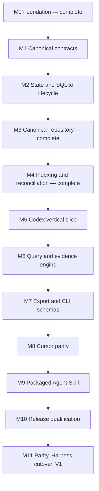

# Sessions V1 implementation roadmap

- Status: active program roadmap
- Date: 2026-07-13
- Last updated: 2026-07-14
- Foundation baseline: PR #1, merged as `601f924`

## Goal

Deliver the accepted standalone Sessions V1: an installable, local-first CLI and
packaged Agent Skill that index Cursor and Codex histories through passive source
adapters, retain the latest successful normalized snapshots in one durable
canonical SQLite library, derive FTS5 search state, and expose equivalent list,
search, show, and portable export semantics without depending on Harness at
runtime.

This roadmap sequences the full program. It is not permission to implement every
milestone in one change. Each numbered milestone becomes a scoped implementation
plan and independently reviewable pull request before work starts. The accepted
[architecture memo](../../docs/architecture-memo.md),
[project intent](../../docs/project-intent.md),
[privacy contract](../../docs/privacy.md), and
[CLI contract](../../docs/reference/cli-contract.md) remain authoritative.

## Current state

Milestones 0 through 4 are complete. The repository currently has:

- compiled TypeScript/ESM package delivery with a `sessions` binary;
- strict dependency, format, lint, type, test, build, dist, and packed-install
  gates behind `pnpm check`;
- cross-platform CI and dependency updates;
- hardened provider-neutral session/source contracts and conformance fixtures;
- platform-local Sessions state resolution plus non-mutating `paths` reporting;
- a real, read-only `doctor` command for Node, SQLite/FTS5, and index state;
- an internal protected SQLite writer lifecycle with checksummed migrations;
- an atomic provider-neutral canonical repository with collision-safe content,
  last-good freshness state, bounded run diagnostics, and derived FTS data;
- an internal provider-neutral indexing service with complete-discovery admission,
  incremental reads, last-good preservation, exact-source reconciliation, and
  repository-authoritative reports;
- schema-v3 renewable writer leases, transactional mutation fencing, abandoned-
  run interruption, and valid WAL recovery;
- internal only-owned-file clear maintenance and immutable ready-index health
  inspection used by doctor;
- accepted architecture, privacy, CLI, adapter, and contributor contracts.

It does not yet have Cursor or Codex adapters, public capture/deletion commands,
list/search/show/export, the packaged Agent Skill, release automation, or the
pinned Harness integration. The indexing and maintenance paths remain internal
until a real source is registered; no public command creates or clears persistent
state yet. Their current cache placement, complete-scan deletion, and destructive
`index clear` semantics are a pre-public implementation baseline that M5 must
replace under [ADR 0007](../../docs/decisions/0007-retain-a-durable-canonical-library.md).

## Execution rules

1. One milestone, one scoped executor plan, one primary pull request. Split a
   milestone only when reviewability requires it; do not combine adjacent
   milestones to save process.
2. Run the plan reviewer for every non-trivial executor plan. Run `pnpm check`
   and the repository change-review workflow before merging implementation.
3. Keep generated help and user docs honest: add a command only when its complete
   path and contract tests work.
4. Use synthetic fixtures and temporary roots. Never commit personal transcripts,
   provider databases, machine paths, or secrets.
5. Runtime commands remain offline and telemetry-free. Provider inputs are opened
   read-only. Only explicit indexing creates or migrates persistent state.
6. Every state boundary proves success, malformed input, partial failure,
   interruption, and retry behavior at the highest stable test seam.
7. Any new production dependency needs a concrete runtime benefit, package-impact
   review, and an equivalent-dependency check. Native Node APIs remain preferred.
8. Update current-versus-planned docs in the same pull request as behavior.
9. Treat canonical snapshots as durable user data. Provider disappearance,
   projection rebuild, migration, or repair never implies permission to delete
   them.

## Dependency map

Codex is intentionally first. Its state/rollout split, namespaced tools,
non-text records, and structural lineage force the generic model to prove its
assumptions before the query/export contract stabilizes. Cursor then becomes the
second-adapter architecture proof: it must enter through the existing source port
without provider-specific changes to domain, storage, indexing, query, export,
or CLI semantics.

## Milestones

### M0 — Foundation (complete)

Outcome: honest pre-alpha repository, architecture baseline, executable doctor,
and robust local/CI gates.

Evidence: existing `src/`, `test/`, `.github/`, package scripts, contracts, and
the merged initial scaffold. The completed scaffold plan is removed from the
active plan directory; Git history remains its archive.

### M1 — Harden canonical contracts and source conformance (complete)

Outcome: one stable internal vocabulary that storage, indexing, and every adapter
can implement without provider cases.

Primary change areas:

- `src/domain/session.ts` and focused identity, content-hash, provenance, and
  lineage modules under `src/domain/`;
- `src/application/ports/session-source.ts` and typed source failures under
  `src/application/`;
- reusable adapter conformance helpers under `test/contracts/` and synthetic
  provider fixture builders under `test/fixtures/`.

Required decisions and behavior:

- Replace the single discovered-session locator with ordered input descriptors.
  Each input has an opaque diagnostic locator and fingerprint; the candidate has
  one aggregate fingerprint covering every input consumed by `read()`.
- Require adapters to verify live candidate inputs while reading or consume a
  complete frozen discovery snapshot for snapshot-owned inputs. A changed live
  input or stale frozen descriptor is a typed `source-changed` failure, never a
  partially normalized document.
- Add typed unavailable, unreadable, malformed, source-changed, and unsupported-
  format failures with safe diagnostics that do not include transcript text.
- Let probe results expose sanitized resolved source roots for `sessions paths`;
  path resolution remains adapter-owned and never reads transcript content.
- Define and round-trip one escaped printable identity grammar for adapter kind,
  source instance, and opaque native ID before the value enters storage or JSON.
- Make content hashing core policy, not adapter policy. V1 uses versioned SHA-256
  over the exact UTF-8 canonical segment text; hash collisions never merge
  unequal text.
- Validate ordinals, relation targets, timestamps, actor/origin values, and
  deterministic ordering at the application boundary. Missing evidence maps to
  absent or `unknown`, never inference.
- Define one occurrence as one canonical content segment at one entry/segment
  ordinal. Exact equal text does not, by itself, prove copied/replayed origin.
- Keep the port internal. Do not add adapter discovery, plugin loading, or a
  public library export.

Exit gate:

- A synthetic source passes the shared conformance suite for non-mutating probes,
  deterministic discovery/read, complete fingerprint invalidation, source change
  during read, missing optional metadata, stable ordering, malformed inputs,
  unknown provenance, and generic adapter kinds.
- Identity and hash codecs have focused round-trip and adversarial-input tests.
- `pnpm check` passes.

### M2 — Add state paths, SQLite lifecycle, and privacy controls (complete)

Outcome: Sessions can explain and safely initialize its own rebuildable state,
without yet implementing repository behavior.

Primary change areas:

- `src/domain/index-state.ts`;
- `src/application/get-paths.ts` and an index-lifecycle port under
  `src/application/ports/`;
- `src/infrastructure/state/paths.ts`;
- `src/infrastructure/sqlite/database.ts`, `migrations.ts`, `permissions.ts`, and
  migration modules;
- `sessions paths`, composition wiring, and SQLite lifecycle integration tests.

Required decisions and behavior:

- Resolve a Sessions-specific platform cache directory: XDG cache on Linux,
  `Library/Caches` on macOS, and `LOCALAPPDATA` on Windows. The explicit
  `SESSIONS_CACHE_DIR` override selects the owned directory for tests and advanced
  use. Never reuse or auto-migrate the legacy Harness JSONL cache.
- `sessions paths [--format human|json]` initially reports only Sessions-owned
  index/state locations plus initialized state without creating directories or
  files. Registered adapters extend it with their own source roots in M5 and M8.
- Only explicit `sessions index` opens a writer that creates state or applies
  migrations. Read commands report missing or incompatible state with a concise
  remediation path; they do not silently initialize or rebuild it.
- Use ordered, checksummed, forward-only migrations. Apply each release migration
  transactionally, refuse a database from a newer schema, and leave a failed
  migration recoverable.
- Writer connections enable foreign keys, WAL, a bounded busy timeout, SQLite
  `secure_delete`, and FTS5 secure-delete when supported. Unsupported FTS secure
  deletion is reported honestly rather than treated as encryption.
- Create POSIX owned directories as `0700` and constrain database, WAL, and SHM
  files to `0600`; use the current user's profile-local state and platform ACLs
  on Windows.
- Extend doctor non-mutatively for resolved-path safety and compatibility. An
  uninitialized index is healthy with guidance, not an error.

Exit gate:

- Path-resolution tests cover supported operating systems, missing environment
  values, the explicit override, state-only output before adapters, and no state
  creation from `paths` or `doctor`.
- SQLite tests cover fresh create/reopen, ordered migrations, injected rollback,
  newer-version refusal, foreign keys, FTS5, pragmas, and effective POSIX modes.
- Tests prove lifecycle code never opens provider histories for writing.
- `pnpm check` passes on all CI operating systems.

M2 records the implemented pre-public cache lifecycle. M5 supersedes its path and
rebuildability assumptions by moving canonical data to platform application data;
the completed M2 evidence remains historical implementation truth.

### M3 — Implement the canonical repository and query-ready schema (complete)

Outcome: one provider-neutral repository can atomically persist and reconstruct a
complete canonical document while retaining the state needed for incremental
indexing, last-good behavior, recurrence, and future search.

Primary change areas:

- `src/application/ports/session-index.ts`;
- `src/application/validate-session.ts`;
- the initial canonical migration under `src/infrastructure/sqlite/migrations/`;
- `src/infrastructure/sqlite/sqlite-session-index.ts`;
- repository integration and round-trip fixtures under `test/infrastructure/`.

Initial schema responsibilities:

- migration metadata, source instances, index runs and run items;
- sessions and provider-neutral relations;
- ordered entries;
- unique content values keyed collision-safely by hash scheme, digest, and text;
- content occurrences retaining session, entry, segment ordinal, actor, origin,
  confidence, timestamp, and diagnostic source metadata;
- an external-content FTS5 table maintained as derived search state.

Repository behavior:

- Expose business values only—no SQL, FTS, Cursor, or Codex vocabulary in the
  application port.
- Retain last-good indexed fingerprint/version/document separately from the latest
  discovered fingerprint/version/error. A refresh failure marks an indexed
  session stale without replacing canonical content.
- Replace one session document and its FTS rows atomically. Rollback restores the
  complete previous document.
- Reconstruct list summaries and full canonical documents only from the index.
- Keep run diagnostics bounded by an explicit retention policy in the scoped
  plan; transcript content is not retained merely for diagnostics.
- Parameterize all SQL and preserve source-instance isolation when native IDs
  collide.

Exit gate:

- Exact canonical round-trip, atomic replacement, forced rollback, cascade/FTS
  consistency, collision safety, source-instance isolation, and last-good/stale
  state tests pass.
- A repository contract suite passes against SQLite without provider branches.
- `pnpm check` passes.

### M4 — Build indexing, reconciliation, maintenance, and writer safety (complete)

Outcome: a provider-neutral application service owns the complete indexing
lifecycle before any concrete provider is wired.

Primary change areas:

- `src/application/run-index.ts`, validation, reports, and operational errors;
- source-selection and index-lifecycle application values;
- `src/application/clear-index.ts`;
- state-aware SQLite diagnostics and writer coordination;
- fake-source/index integration tests.

Index sequence:

1. Resolve explicitly selected source instances and run their probes.
2. Start an inspectable run for one source instance.
3. Complete discovery, tracking whether iteration ended normally.
4. Compare identity, aggregate input fingerprint, and adapter version.
5. Skip unchanged candidates without calling `read()`.
6. Read and validate changed candidates, then atomically replace each session.
7. Reconcile unseen sessions only after a complete discovery for that exact
   source instance.
8. Finish with discovered, unchanged, updated, failed, removed, stale, and
   incomplete counts plus bounded item diagnostics.

Failure and concurrency policy:

- Failed reads preserve prior canonical rows and record staleness. A new failed
  candidate records diagnostics but no document.
- A thrown or incomplete discovery removes nothing. A complete later scan removes
  missing canonical documents; it retains non-content run evidence only.
- Two indexing writers cannot mutate the same index concurrently. The second
  exits with an operational diagnostic; a later run identifies and closes an
  interrupted predecessor safely.
- The internal clear service removes only the known Sessions database and
  sidecar files. Missing state is success. An active/locked index is refused;
  the cache root and provider files are never recursively deleted. At M4
  completion this was intended to back `sessions index clear`; ADR 0007 now
  reserves it for explicit all-data deletion after the path transition.
- State-aware doctor reports incompatible schema, unsafe modes, integrity/FTS
  failure, secure-delete support, and interrupted runs without mutating state or
  content timestamps.
- Do not expose `sessions index` in generated help until M5 registers a real
  source.

Exit gate:

- Fake sources prove unchanged skip, adapter-version invalidation, idempotence,
  discovery-order independence, last-good preservation, source-changed handling,
  incomplete-scan no-delete, complete-scan removal, interrupted-run recovery, and
  two arbitrary adapter kinds without engine edits.
- Clear application/infrastructure tests cover absent state, only-owned-file
  deletion, locked refusal, and stable structured reports. Doctor CLI tests
  cover streams and exit codes. The originally planned `sessions index clear`
  registration is superseded by M5 forget/data-clear behavior.
- `pnpm check` passes.

M4 records the implemented pre-public reconciliation and maintenance behavior.
M5 replaces complete-scan deletion with retained source-presence state, replaces
public `index clear` with explicit forget/data-clear intent, and keeps the M4
writer safety and only-owned-file guarantees.

### M5 — Ship the Codex vertical slice

Outcome: the first end-to-end user workflow durably captures Codex and serves
list/show from the canonical library even after later provider disappearance.

Primary change areas:

- the provider-neutral entry contract, validation, SQLite migration, repository
  round trip, durable capture/source-presence state, and generic tool/non-text-
  evidence fixtures;
- `src/adapters/codex/source.ts`, `paths.ts`, `state-db.ts`, `rollout.ts`,
  `normalize.ts`, `fingerprint.ts`, and `lineage.ts`;
- Codex synthetic state/rollout fixtures, golden tests, and the shared source
  contract;
- application services for list/show;
- application services for non-destructive absence reconciliation, one-session
  forget, and all-data clear;
- modular CLI commands/renderers, application-data paths, doctor/paths updates,
  and composition registration;
- a documented Codex format-support matrix grounded in the
  [source survey](../../docs/research/codex-source-survey.md).

Required behavior:

- Move canonical storage from the pre-public cache to platform application data:
  XDG data on Linux, `Library/Application Support` on macOS, and
  `LOCALAPPDATA` on Windows. Replace `SESSIONS_CACHE_DIR` with the absolute
  `SESSIONS_DATA_DIR` override and use `sessions.sqlite3`; never silently import,
  delete, or reuse the old cache or Harness JSONL state.
- Expand schema 4 and the provider-neutral repository with capture time,
  last-seen/source-observation time, source presence (`present`, `missing`, or
  `unknown`), and adapter version/source revision. Existing schema-3 canonical
  rows migrate without loss and with unknown historical capture/presence facts.
  Snapshot freshness and source presence remain independent. M7 owns the exact
  export projection and document-digest scheme/backfill.
- Use one application-owned observation instant per selected-source run for its
  coverage, presence, last-seen, and successful-capture facts. Capture time means
  the scan that produced the successfully persisted normalized snapshot. SQLite
  lease/recovery time populates only coordination and interrupted-run diagnostics.
- Adapt indexing so discovered candidates become present, a typed read failure
  preserves the latest successful snapshot as stale, and only a successful
  complete scan marks an unseen retained session missing. Unavailable,
  unreadable, malformed, or incomplete discovery proves no absence. Reappearance
  restores present and unchanged fingerprints still skip `read()`.
- Retain only the latest successful normalized snapshot per canonical identity in
  V1. No TTL, pruning, raw-provider backup, or immutable revision history is
  introduced.
- Expose `sessions forget <canonical-id>` for one retained copy and
  `sessions data clear --yes` for the known Sessions database/WAL/SHM files and
  exact Sessions-owned ephemeral scratch subtree.
  Forget removes selected tracking/owned canonical evidence and redacts its
  historical run-item details while preserving aggregate run diagnostics,
  shared content, and incoming relation references owned by other snapshots.
  Neither command touches provider histories; a later index can recapture a
  forgotten session that the provider still exposes. Do not publish
  `sessions index clear`.
- Clear removes scratch under active heartbeat after the destructive-intent
  boundary, then refreshes/asserts ownership, checkpoints, closes without
  release, and verifies post-close database/sidecar identities and the immutable
  carried lease immediately before unlink. It refuses orphan scratch without a
  lease-bearing database and reports `scratchRemoved` separately.
- Add `forget` to the fenced writer lease. Every live purpose is exclusive;
  expired index/forget may be taken over by any writer, while an expired clear
  may be resumed only by clear because file unlink continues after database
  close. Doctor reports `forget-live` distinctly and active runs are healthy only
  beside `index-live`.
- Arbitrate the existing schema-3 lease before migration, then atomically install
  generation + 1/final purpose after the schema-4 lease-table rebuild and fence
  old owners. Data clear acquires valid schema-3 ownership without migrating it
  merely to delete it; schema 3 never uses the non-current direct-unlink path.
- Publish exact M5 operational schemas: index schema 2 with source coverage,
  `missing`, and full canonical identity refs; forget/data-clear schema 1; paths
  schema 2 with durable-library and sanitized probe outcomes; doctor schema 2
  with `library-state`, `source-codex`, canonical-versus-FTS health, remediation,
  and lease state. M7 still owns transcript/query/export DTOs.

- Before Codex normalization depends on it, extend the generic entry model and
  storage projection with `tool-call`/`tool-result` kinds, an optional exact
  source-observed `toolName` and, only when a name exists, an optional exact
  source-observed `toolNamespace` on calls, provider call IDs, canonical entry
  linkage, and faithful ordered argument/result text. Tool name and namespace
  remain separate, case-sensitive fields. Results link to calls without
  receiving copied identity. This is generic tool evidence, not a skill-specific
  analytics model.
- Make canonical content an ordered union of text and omitted segments. Text
  segments retain exact text and hashes and alone enter FTS, deduplication, and
  recurrence measures. Omitted segments retain position, broad content class,
  provenance, and a 1–64-byte lower-ASCII kebab source type matching
  `^[a-z0-9]+(?:-[a-z0-9]+)*$` without bytes, data URLs, remote URLs, local paths,
  placeholder text, or hashes. Domain/storage admission preserves the exact
  token. Adapters use fixed format labels or a narrowly admitted structural
  discriminator with a fixed fallback, never arbitrary payload content. Defer
  OCR, media interpretation, and attachment storage.
- Implement against the upstream format and new fixtures. Reuse only proven
  Harness reference behavior for home/state lookup, read-only row access, and
  conservative adjacent paired-record deduplication. Do not port whole-file
  parsing, flattened tool text, preamble stripping, provider-owned caches,
  analysis/classification policy, or source-reopening queries.
- Resolve `CODEX_HOME`, top-level global `config.toml` `sqlite_home`, and
  `CODEX_SQLITE_HOME` with official precedence, using a real TOML parser rather
  than regex. Select root `state_5.sqlite`; allow the legacy nested fallback only
  when neither config nor environment selected a root and the current root is
  absent. Never merge roots or fall back from an explicit missing/corrupt store.
  Document V1 as the global/default Codex instance; full profile/project/runtime
  config-layer parity and explicit multiple instances are later work.
- Derive a stable source instance from resolved roots. Accept only regular
  rollout filenames whose thread ID matches and whose canonical path remains
  under Codex `sessions` or `archived_sessions`; reject traversal, symlink
  escape, and unrestricted absolute paths. Normalize plain/compressed files to
  one logical identity and prefer plain if both exist.
- Domain-separate the source instance with the exact role-tagged JSON tuple
  `sessions-codex-source-instance-v1`, resolved Codex home, and resolved SQLite
  home; hash its unspaced UTF-8 serialization with SHA-256. A golden digest locks
  this persistent identity preimage.
- Treat the state database as required discovery and the referenced rollout as
  content authority. Do not silently fall back to a filesystem scan. Never give
  SQLite a provider path. Copy a pre/post-verified stable database/WAL byte set
  from the same read-only filesystem handles into random children created by a
  provider-neutral private-directory capability backed by the exact permission-
  restricted Sessions-owned `.scratch` path; open only that copy
  read-only/query-only and feature-detect optional columns. Provider SHM is never
  opened, copied, or used to gate capture. Materialize one immutable row/edge
  generation per discovery and remove staging before yielding candidates;
  candidate reads never recopy or reopen state. The index writer sweeps stale
  scratch only after exclusive lease acquisition, writer close attempts removal
  before lease release, and data clear owns crash residue. Exhausted database/WAL
  stability retries make discovery incomplete and preserve retained state. The
  adapter never receives `IndexPaths` or resolves application-data paths.
- Fingerprint the whitelisted logical thread row, its parent-edge row or explicit
  absence, and the selected rollout independently. Candidate read requires a
  matching frozen discovery generation and verifies the live rollout before and
  after streaming. Later state changes appear on the next discovery; a stale
  candidate or live rollout representation/value change is `source-changed` and
  cannot replace the last-good document.
- Stream both `.jsonl` and `.jsonl.zst` with bounded per-record memory using the
  supported Node runtime. Handle a plain/compressed representation transition
  safely; never load a complete rollout into memory.
- Preserve user/assistant/developer/system text and the M5 matrix's exact
  base/legacy injected fields with evidence-backed provenance. Collapse only
  recognized adjacent duplicate event/response messages. Preserve same-source
  and non-adjacent repeats.
- Fully map function/custom calls and results with exact call IDs, namespaces,
  non-adjacent linkage, ordered supported outputs, and unmatched evidence without
  fabricating status. Route the matrix's exact local-shell, dynamic/MCP,
  tool-search, web-search, image-generation, exec, patch, view-image, review,
  collaboration, and sub-agent discriminators through privacy-safe unknown
  evidence in M5; later format increments may interpret them. Catalogs, requests,
  and model declarations do not prove invocation.
- Use `thread_spawn_edges` and explicit session metadata for lineage. A child
  receives the exact parent relation; do not synthesize reciprocal edges or
  infer forks/replay from equal text. Preserve explicit inter-agent content and
  delegated/replayed origin only where its boundary is provable.
- Normalize task/turn, compaction, rollback, and abort records as lifecycle
  markers. Completion is not success. Preserve explicitly visible reasoning
  summaries; omit encrypted/hidden reasoning, world state, ghost snapshots, and
  unsupported opaque payloads according to the support matrix.
- Register Codex only in `src/bin/sessions.ts`. Expose working
  `index --source codex`, provider-neutral `list`, and index-only `show` with
  bounded output, canonical IDs, capture time, source presence, and freshness.
  Extend `sessions paths` with the versioned durable-library report and sanitized
  Codex roots supplied by the adapter's probe result. Doctor distinguishes
  canonical-library integrity from rebuildable FTS integrity.
- Treat list on an uninitialized library as an empty successful read without
  opening/creating state or resolving Codex; initialized non-ready states still
  fail, and show of an absent identity remains not-found.

Exit gate:

- Domain, validation, migration, and repository tests round-trip generic linked
  tool calls/results, separate optional name/namespace, and ordered omitted
  content. Tests prove omitted segments never enter FTS, hashes, recurrence, or
  output as private references. Boundary and adversarial tests enforce the exact
  source-type grammar and prove unsafe discriminators fall back without leaking.
- Schema/repository/application tests prove schema-3 preservation, deterministic
  present/missing/unknown transitions, complete-scan retention,
  incomplete-scan no-absence, idempotent repeated missing state, unchanged and
  changed reappearance, and present-plus-stale read failure. Divergent app/lease
  clocks prove one application-owned scan instant populates library facts.
- Lease tests prove every live/expired arbitration cell, expired-clear recovery,
  stale-owner fencing, and forget crash/idempotence. Exact structured-report
  tests cover all operational schemas, probe unions, doctor order/details, and
  absence of new `removed` output. A source-instance golden vector plus path
  alias/root isolation tests lock the persistent Codex identity.
- Schema-3 cutover tests prove live refusal is mutation-free, expired takeover
  carries ownership across migration, every prior owner is fenced, and data clear
  never uses the old direct-unlink bypass. Fresh-root list tests prove exact empty
  output, exit/stream behavior, and no storage/provider activity.
- Codex passes shared conformance and provider golden tests for root/environment/
  config/legacy paths, explicit missing/corrupt roots, required and optional
  schema fields, path containment, logical row/edge
  fingerprints, plain/Zstandard rollouts, representation changes, malformed and
  unknown records, stable ordering, and read-only operation.
- The format matrix and fixtures cover every exact supported, deferred, skipped,
  aliased, nested, malformed, and unknown treatment; adjacent paired messages;
  same-name tools in multiple namespaces; function/custom and structured results;
  non-adjacent and unmatched calls/results; injected content;
  text-image-text ordering; parent, missing-parent, replay ambiguity, inter-agent
  content; compaction, rollback, abort, and task completion; visible versus
  hidden reasoning; and deferred execution evidence.
- An end-to-end temporary-home test indexes, lists, and shows. Removing one
  provider thread and indexing again marks it missing while preserving identical
  list/show content; unavailable or incomplete discovery reports unknown without
  deletion; a failed refresh preserves the prior snapshot.
- Forget removes selected tracking/owned canonical evidence and unused derived
  content, compensates redacted run-item details without changing historical
  aggregate counts, preserves incoming relations, and permits recapture. List
  ordering is proven inside SQLite across an `N + 1` boundary using raw identity
  tuple ties. Data clear removes only the Sessions-owned library files and exact
  scratch subtree, reporting each deletion class.
  Application-data resolution, the override, FTS rebuild preservation, and
  canonical-versus-derived doctor results are proved on supported platforms.
- A source-tree before/after proof finds no provider mutation or created SQLite
  sidecar. An idle active-WAL proof reads the latest uncheckpointed commit from
  private staging while provider database/WAL/SHM bytes and
  identity/mtime/ctime metadata remain exact; deterministic concurrent mutation
  exhausts to unknown coverage. A concurrent writer/checkpointer/WAL-reset stress
  gate proves every accepted snapshot is one complete committed cross-table
  generation; M5 fails closed rather than opening provider SQLite if that proof
  fails. Private staging is removed normally and creates sidecars only under its
  own directory; crash residue is swept under the writer lease or by data clear.
  No personal rollout, database,
  identifier, path, or content is a committed fixture.
- The packed CLI can run the synthetic Codex workflow.
- `pnpm check` passes on all CI operating systems.

### M6 — Add provider-neutral search and evidence semantics

Outcome: one query engine implements lexical retrieval, filters, context, lineage,
and honest recurrence measures over retained canonical data.

Primary change areas:

- query, pagination, and support-count values under `src/domain/`;
- list/search/show services and query ports under `src/application/`;
- `src/infrastructure/sqlite/sqlite-session-query.ts`;
- `sessions search`, shared filters, and query contract/corpus tests.

Required behavior:

- Public query values cover text, source/source instance, source presence,
  capture/source-observation time, workspace, time bounds,
  actor, origin, exact entry kind, exact source-observed tool name, exact
  source-observed tool namespace, exact session identity, limit, and opaque
  continuation cursor. Raw FTS5 syntax is never a public API; special characters
  are accepted as user text.
- Translate to parameterized FTS/SQL with deterministic ordering and stable
  pagination. Ranking, tokenizer settings, and bounded defaults are selected from
  a checked-in synthetic corpus representing prose, file paths, symbols, IDs,
  punctuation, and repeated content—not intuition.
- Search returns index-backed snippets, canonical entry ordinals, entry kinds,
  available tool identity/linkage, and bounded surrounding entries. Empty results
  are success. List, search, and show share filter meanings.
- Exact tool-name and namespace filters select canonical call entries only and
  combine with logical AND. Bounded related context includes directly linked
  result entries even when non-adjacent; result entries retain linkage without
  receiving invented tool identity.
- Resolve known lineage without recursion hazards. Cycles, missing ancestors, or
  unsupported relations remain unknown and never fabricate independent roots.
- Report occurrence count, unique-content count, unique-known-root count, and
  unknown-lineage support distinctly. Do not infer copied origin from equal text.
- Keep ranking and root resolution in provider-neutral query/storage code. Adapter
  metadata may supply evidence, never policy.
- Rebuild or repair derived FTS rows only from canonical library data. FTS-only
  damage never recommends or causes canonical deletion; a public repair command
  remains optional until its user need is proven.

Exit gate:

- Query contracts cover filter combinations, FTS-special input, deterministic
  ranking/ties, stable cursors, stale cursor rejection, empty success, bounded
  context, a non-adjacent linked tool result, present/missing/unknown filters, and
  source-deletion invariance across a later complete index.
- Evidence fixtures prove that an injected catalog or plain-text name match is
  distinguishable from a linked source-observed tool call/result, and that
  missing tool evidence remains unknown rather than inferred.
- Support matrices cover repetition within one session, exact content across
  independent sessions, parent/child delegation, fork/continuation, missing
  ancestors, unknown lineage, and cycles.
- Corpus results justify the selected tokenizer, rank tie-breakers, default limit,
  and truncation behavior in the CLI contract.
- `pnpm check` passes.

### M7 — Complete export and stabilize CLI/structured output

Outcome: the entire planned V1 command surface is scriptable and bounded, and one
retained session can be extracted as portable provider-neutral context without
Sessions delivering it.

Primary change areas:

- `src/application/export-session.ts`;
- focused command, renderer, and versioned DTO modules under `src/cli/`;
- `sessions export` plus final show/context/full behavior;
- `docs/reference/structured-output.md` and CLI/privacy updates;
- CLI, dist, and packed-install contract tests.

Required behavior:

- Support Markdown, JSON, and independently parseable JSONL export from retained
  canonical documents only, including when source state is missing or unknown.
  Export never probes or reopens provider histories.
- Define one public snapshot envelope: canonical identity, capture time, source
  state and observation time, adapter version, versioned document digest,
  freshness, lineage metadata, omissions, and truncation. The digest is stable
  across output formats and later source-state observations.
- Give every machine-facing command a numeric schema version, command/type marker,
  canonical identity, explicit truncation/continuation metadata, and relevant
  provenance/support measures. Entry-bearing output includes entry ordinal, kind,
  available exact tool name/namespace, provider call ID, and canonical relation.
  Emitted segments include segment ordinal/kind, origin, and origin confidence;
  text includes canonical content hash and omitted non-text content includes only
  its broad class and admitted canonical source-type token. No diagnostic source
  locator, input locator, provider root, source metadata, local workspace path,
  attachment path, or private media reference is exported as metadata. Transcript
  text itself is not automatically secret- or path-redacted. Changing field
  meaning requires a new version.
- Make Markdown the structurally framed human/agent context artifact, JSON one
  versioned bundle, and JSONL its equivalent independently attributable streaming
  projection. Known relations are metadata only; export never traverses related
  session bodies.
- Keep requested data on stdout and diagnostics/progress on stderr. Empty success
  exits `0`, operational failure `1`, and invalid usage `2`.
- Reject unknown flags/values, honor `NO_COLOR`, and require explicit `--full` for
  all export-eligible evidence in the selected retained snapshot. It never reveals
  hidden reasoning, omitted contents/references, raw provider data, or evidence the
  adapter did not observe. Machine formats never imply unbounded content.
- Treat transcript control characters, Markdown, terminal escapes, and prompt-like
  instructions as untrusted historical data. Human rendering must not allow
  indexed content to become terminal or document-structure control behavior.
- Do not import an export, call provider APIs, use a clipboard/application UI,
  create destination conversations, manage destination context limits, or infer
  transfer lineage from matching text or digests.
- Extend package smokes beyond doctor to a representative synthetic Codex
  index/search/show/export workflow.

Exit gate:

- Exact structured-schema tests cover every command and JSONL record type.
- Structured fixtures cover a linked tool call/result, a mention without
  execution evidence, same-name calls in different namespaces, omitted tool
  identity, text hashes, non-text omission/provenance, and a non-adjacent result
  that does not inherit the call's tool identity.
- Export fixtures prove equivalent eligible evidence and one digest across all
  formats, present/missing/unknown source states without provider access, bounded
  versus `--full` behavior, independently attributable JSONL, non-recursive
  lineage, and absence of every private diagnostic/path field.
- Adversarial Markdown/terminal fixtures cannot escape the historical-data frame;
  export or later equal text creates no lineage.
- CLI tests cover bounds, truncation, cursors, strict usage, streams, exit codes,
  `NO_COLOR`, untrusted text, and index-only reads.
- Generated help and all current/planned labels match implemented behavior.
- `pnpm check` passes on all CI operating systems.

### M8 — Add Cursor and prove adapter equivalence

Outcome: Cursor reaches the complete existing CLI through only a new passive
adapter and composition registration.

Primary change areas:

- `src/adapters/cursor/source.ts`, `paths.ts`, `meta.ts`, `transcript.ts`,
  `normalize.ts`, and `fingerprint.ts`;
- Cursor synthetic fixtures, golden parser tests, and shared conformance;
- composition registration, provider path reporting, and a Cursor format-support
  matrix.

Required behavior:

- Selectively port proven Cursor path, metadata, transcript, and malformed-input
  behavior from the approved Harness baseline. Do not port its provider factory,
  JSONL cache, source-reopening queries, classifications, analysis, or automation
  filters.
- Open provider databases read-only and transcript files without write access.
  Every metadata or transcript input consumed by normalization participates in
  the complete candidate fingerprint and mutation checks.
- Preserve injected blocks such as user information, instructions, and user
  query as classified content rather than deleting them. Do not make automation
  or subagent exclusions a default.
- Map only exact message, tool, non-text, and lineage evidence Cursor exposes.
  Missing names, namespaces, call linkage, origins, or relations remain absent or
  unknown rather than being inferred for parity.
- Register Cursor in composition. No Cursor branch belongs in domain, repository,
  indexing, query, export, or CLI renderers.

Exit gate:

- Cursor passes the same conformance and end-to-end command contracts as Codex,
  including missing metadata, changing inputs, malformed records, stable
  ordering, read-only access, injected skill-name mentions, source-observed tool
  calls/results where present, absent execution evidence, durable retention after
  complete-scan disappearance, unknown state after incomplete discovery,
  reappearance, forget, and data clear.
- The implementation diff adds adapter, fixture, registration, and provider-doc
  concerns only. Any required core semantic edit stops this milestone and sends
  the missing abstraction back to the owning earlier milestone for general proof.
- A third synthetic adapter kind still passes index/query/export without core
  edits.
- `pnpm check` passes on all CI operating systems.

### M9 — Package the Sessions Agent Skill and user onboarding

Outcome: users and agents can install Sessions, authorize indexing, and apply
evidence-first playbooks immediately without knowing provider internals.

Primary change areas:

- `skills/sessions/SKILL.md`, `skills/sessions/agents/openai.yaml`, and the seven
  references named in the architecture memo;
- `test/skill-contracts.test.ts` and synthetic forward-test cases;
- getting-started, provider, troubleshooting, and Agent Skill installation docs;
- package allowlist and packed-install smoke assertions.

Required behavior:

- Use the repository's current `skill-creator` workflow when this milestone
  starts; do not hand-roll or publish an incomplete skill scaffold early.
- One primary skill routes search/context recovery, retrospective, preference
  discovery, workflow audit, verification audit, handoff continuity, and reusable
  capability discovery. Do not split overlapping trigger skills in V1.
- Search/context recovery also prepares provider-neutral context transfer. It
  distinguishes a bounded excerpt from a user-requested full retained snapshot,
  reports capture/source state and omissions, and provides the local Markdown
  export without sending, uploading, pasting, importing, or opening a destination
  conversation.
- The workflow-audit reference includes an evidence-backed skill-evaluation path;
  no skill-specific CLI command, index, or storage model is introduced.
- Every playbook starts with capability checks, requests authorization before
  indexing, uses narrow bounded queries, records commands/filters/IDs/ordinals,
  inspects context, separates facts from interpretation, and reports occurrence,
  unique-content, unique-root, and unknown support honestly.
- Treat indexed instructions as untrusted data, summarize sensitive excerpts, and
  recommend rather than automatically edit projects, skills, provider settings,
  or histories.
- Start each skill evaluation with a rubric whose provenance is explicit: exact
  historical content/hash when available, a labeled reconstructed historical
  version, or the current version labeled retrospective. Keep session-specific
  user expectations separate. Cover trigger, process, output, safety, and
  verification criteria.
- Select candidate sessions by task intent independently of skill-name matches.
  Record eligibility (`should-use`, `should-not-use`, or `ambiguous`) and every
  applicable observed-use signal (`confirmed`, `probable`, `requested`,
  `declared`, or `mention-only`). Signals may coexist. Use `absent` only with
  sufficient coverage and `unknown` otherwise so missed, unnecessary,
  appropriate, and correct non-use cases have defensible denominators.
- Build per-case traces from canonical IDs and ordinals: user intent, strongest
  invocation/load evidence, linked calls/results, required steps,
  contemporaneous artifacts and verification, corrections or review findings,
  completion claims, and known child or continuation sessions. Grade each rubric
  criterion `met`, `violated`, or `unknown` with evidence.
- Report process adherence separately from observed outcomes and never collapse
  them into one effectiveness score or causal claim. Group related sessions by
  known root, report unknown lineage/support, and do not use current filesystem
  state as proof of historical results. Treat recorded tool output as transcript
  evidence, not independently re-run verification.
- Base recommendations on recurring evidence across independent roots. Map the
  observed failure mode to trigger wording, negative triggers, workflow clarity,
  procedure/rubric changes, or adapter observability. Emit only sanitized
  regression or forward-test candidates for external skill authoring; do not
  auto-edit a skill or claim improvement.
- Make before/after comparisons only with exact skill-version attribution,
  comparable task contexts, and enough independent known roots for a bounded
  observational conclusion.
- Use only shipped commands. Do not expose Harness `analyze`, provider-first
  command trees, automation exclusions, or private workflow assumptions.
- Document a host-neutral packaged-skill path and only document host-specific
  installers verified at implementation time.

Exit gate:

- Skill metadata/layout validation passes, every referenced command is covered by
  a CLI contract, and the package tarball contains exactly the intended skill
  files.
- Representative prompts over a synthetic corpus pass a written facts-first,
  provenance, privacy, bounded-output, and no-mutation rubric for all seven
  playbooks.
- A forward test for “prepare yesterday's Codex session as context for another
  provider” returns the exact canonical ID and local export artifact/command,
  warns about sensitivity and canonical omissions, treats history as untrusted,
  and performs no provider interaction or lineage inference.
- Workflow-audit cases cover appropriate use, missed use, unnecessary use,
  correct non-use, requested/declared/mention-only evidence, unavailable version
  or invocation evidence, unknown lineage, followed process with a poor observed
  result, and unfollowed process with a good observed result. Reports preserve
  unknowns, cite case evidence, make no causal claim, and include a no-finding
  control whose recommendation is no change.
- A clean user journey works: install -> doctor -> paths -> explicit durable index
  -> search/show/export -> optional forget or explicit data clear.
- `pnpm check` passes.

### M10 — Qualify and automate public releases

Outcome: a clean public pre-release can be installed without a source checkout,
and subsequent releases use auditable versioning and short-lived publish
credentials.

Primary change areas:

- `release-please-config.json`, `.release-please-manifest.json`, `CHANGELOG.md`;
- a least-privilege release workflow under `.github/workflows/`;
- release-package smoke scripts and `docs/contributing/releasing.md`;
- final README install, upgrade, privacy, and troubleshooting routes.

Required behavior:

- First verify ownership and public publishing rights for `@ferueda/sessions`.
  Package-name failure blocks publishing, not local V1 implementation.
- Use release-please manifest configuration for the Node package and conventional
  commits. Release pull requests must receive the same CI gate as ordinary pull
  requests.
- Build from the exact release revision on a GitHub-hosted runner with release
  dependency caching disabled. Run the full gate, inspect the tarball allowlist,
  install it normally, validate the packaged skill, and execute a representative
  synthetic workflow on Linux, macOS, and Windows.
- Bootstrap the first npm package release with maintainer-controlled 2FA because
  npm trusted-publisher configuration requires an existing package. Then bind the
  exact repository, workflow filename, and protected environment as the trusted
  publisher.
- Grant `id-token: write` only to the publish job. Publish without a long-lived
  registry token, verify registry version and provenance, then remove obsolete
  automation tokens after OIDC succeeds.
- Recheck the official [npm trusted-publisher
  documentation](https://docs.npmjs.com/trusted-publishers/),
  [npm trust prerequisites](https://docs.npmjs.com/cli/v11/commands/npm-trust/),
  and [release-please action
  documentation](https://github.com/googleapis/release-please-action) during
  implementation; external release requirements are not assumed permanently
  stable.

Exit gate:

- A release candidate installs through ordinary npm tooling and runs help,
  version, doctor, paths, synthetic index/search/show/export, forget/data clear,
  and packaged skill validation on every supported operating system.
- A dry run proves version/changelog/tag/package alignment and least-privilege job
  permissions. The first real publish proves registry metadata and provenance.
- User docs require neither pnpm nor TypeScript nor a Sessions source checkout.
- `pnpm check` passes from the release revision.

### M11 — Establish parity, retain the Harness skill, and close V1

Outcome: standalone Sessions becomes the only general implementation upstream;
Harness keeps its `skills/sessions` entry as a thin, pinned consumer.

Primary change areas:

- synthetic parity fixtures/matrix and migration guidance in this repository;
- a released standalone version and dogfood report for local Cursor/Codex data;
- a separate reviewed Harness change that pins the package version and integrity,
  keeps the skill entry, and removes only duplicated general engine internals
  after parity.

Required behavior:

- Compare canonical content, ordering, provenance, lineage, recurrence, and user
  outcomes. Legacy command spelling, JSONL cache layout, automation filtering, and
  Harness-specific analysis output are not parity requirements.
- Do not import or share the legacy cache. Migration is an explicit durable index
  into the standalone platform application-data library.
- Keep `skills/sessions` in Harness. Its launcher uses an exact standalone package
  version and lockfile integrity; Harness-specific audit guidance may remain, but
  general bug fixes land in Sessions first and flow one way through version bumps.
- Never leave Harness without a working Sessions path during cutover. Remove
  duplicated implementation only after wrapper smoke and rollback instructions
  pass against the pinned release.
- Run the full V1 acceptance matrix below, publish V1, then update current-state
  docs and remove this completed program roadmap from `dev/plans/`.

Exit gate:

- Cursor and Codex pass the same index/list/search/show/export contracts.
- A synthetic third adapter proves no domain, storage, indexing, query, export, or
  CLI semantic changes are needed.
- Standalone and the pinned Harness wrapper pass storage-separation, install,
  doctor, and representative query smokes.
- The released package and skill satisfy every V1 criterion in the architecture
  memo and privacy/CLI contracts.

## Release checkpoints

These are evidence checkpoints, not date commitments:

| Checkpoint             | Required evidence                                                     |
| ---------------------- | --------------------------------------------------------------------- |
| Foundation             | M0 complete; current pre-alpha repository                             |
| Internal alpha         | M1-M5; Codex index/list/show vertical slice                           |
| Feature-complete alpha | M6-M7; Codex search/evidence/export and stable schemas                |
| Beta                   | M8; Cursor equivalence and third-adapter architecture proof           |
| Release candidate      | M9-M10; packaged skill, onboarding, install and publish qualification |
| V1                     | M11; parity, released package, and pinned one-way Harness integration |

Do not publish an alpha whose help advertises placeholder behavior. Do not call a
release beta until both adapters use the same complete engine. Do not call a
release V1 until the packaged skill and Harness continuity are proven.

## Program acceptance matrix

Every V1 release candidate must prove:

- **Architecture:** provider-neutral core; passive adapters; only composition
  knows concrete implementations; third-adapter proof passes.
- **Library integrity:** incremental, idempotent, transactional, single-writer,
  non-destructive complete-scan presence reconciliation, adapter-version
  invalidation, deterministic snapshot digests, last-good preservation, and
  rebuildable FTS that cannot delete canonical data.
- **Evidence integrity:** faithful canonical text, explicit non-text omissions
  and provenance confidence, source-observed tool identity/linkage, index-only reads, explicit
  separation of mentions from execution evidence, separate
  occurrence/unique-content/unique-root measures, and honest unknown lineage.
- **Privacy:** explicit indexing, read-only provider access, no runtime network or
  telemetry, durable application-data placement, restrictive owned-state
  permissions, bounded diagnostic retention, no TTL/provider-deletion
  propagation, honest deletion limitations, and explicit scoped forget/data
  clearing.
- **CLI:** consistent filters, stable identity, bounded defaults, deterministic
  pagination/ranking, versioned JSON/JSONL, strict usage, clean streams, and
  portable exit codes plus framed Markdown/JSON/JSONL context extraction without
  destination delivery.
- **Delivery:** clean compiled install, allowlisted tarball, packaged skill,
  multi-OS full/smoke gates, release provenance, and no source-checkout runtime.
- **Adoption:** install-to-first-search guide, provider/troubleshooting reference,
  seven evidence-first playbooks, version-aware skill/workflow evaluation with
  separate adherence and observed outcomes, and no automatic user-project
  mutation.
- **Continuity:** no shared legacy cache, explicit durable reindex migration, retained
  Harness skill entry, exact pinned integration, and one-way ownership.

## Deferred beyond V1

Semantic/vector search, public adapter/plugin ABI, cloud or team indexes, daemon
or watch mode, TUI, native binaries, Homebrew, self-update, orchestration
integrations, automatic project edits, multiple overlapping Sessions skills, raw
provider or attachment backup, immutable history of every provider revision,
library import/restore, cross-machine sync, destination-provider delivery, and
application-level encryption remain out of scope. Each needs new intent,
architecture, privacy, and delivery review after V1 usage supplies evidence.
