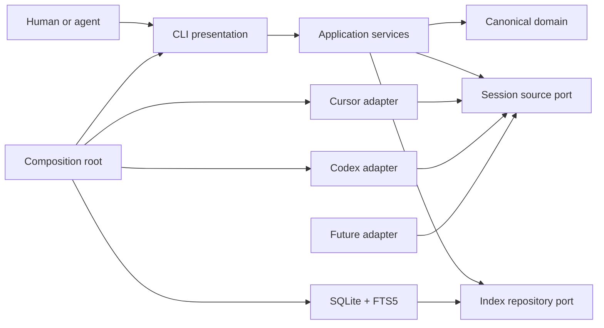

# Standalone Sessions architecture memo

- Status: accepted design baseline
- Date: 2026-07-13
- Scope: standalone repository through V1

## Executive summary

Build Sessions as a new local-first product, using the Harness implementation as evidence and reusable parser material rather than as a codebase to clean up in place.

The core owns a provider-neutral session model, indexing lifecycle, SQLite/FTS5 storage, and structured query semantics. Cursor, Codex, and future adapters only probe, discover, read, and normalize their sources. The CLI and Agent Skill consume the same application services. Provider histories remain read-only; the canonical index is the only source for list, search, show, and export.

The public delivery target is an npm package named `@ferueda/sessions` with a `sessions` binary, compiled JavaScript, Node.js 24.15 or newer, package-install smoke tests, cross-platform CI, and later release-please plus npm trusted publishing and provenance.

## Context

The existing [Harness Sessions skill](https://github.com/ferueda/harness/tree/fead436b9c810c3f0a3952789f0716765ddbc8f9/skills/sessions) proved the value of local transcript search and supplied real Cursor/Codex parsers, fixtures, output patterns, and retrospective workflows.

It also revealed boundaries that should not cross into a general product:

- The command entrypoint mixes command definition, orchestration, rendering, filtering, and provider construction.
- Provider interfaces own indexing, cache access, querying, transcript reads, and turn iteration.
- Concrete adapters write their own cache snapshots.
- Core types close over known providers.
- Analysis includes Harness-specific workflow evidence and automation/subagent policy.
- Some views reopen mutable source histories instead of reading one canonical snapshot.
- Installation symlinks TypeScript from a source checkout rather than delivering an ordinary public CLI.

Those constraints are useful migration evidence, not the standalone architecture.

## Product and design principles

1. **Local by default.** No transcript leaves the machine during ordinary use.
2. **Facts before inference.** Preserve source evidence and label classification confidence.
3. **One canonical engine.** Index, reconcile, search, show, and export behave the same for every adapter.
4. **Passive adapters.** Source-specific code translates inputs; it does not choose business policy.
5. **Honest interfaces.** Current help and docs expose only working behavior. Planned behavior is visibly planned.
6. **Scriptable delivery.** Stable exit codes, bounded output, versioned structured formats, and clean streams.
7. **Rebuildable state.** The index is disposable local derived data, while source histories remain authoritative inputs.
8. **One upstream after parity.** Standalone Sessions becomes the implementation owner; Harness keeps a thin pinned integration.

## Target system



Arrows represent dependencies on contracts, not runtime call direction. Domain code imports no outer layer. Application code imports domain and its own ports. Adapters and SQLite implement inward-facing ports. Only the composition root knows concrete implementations.

### Layer ownership

| Layer           | Owns                                                                                           | Must not own                                              |
| --------------- | ---------------------------------------------------------------------------------------------- | --------------------------------------------------------- |
| Domain          | Canonical identities, sessions, entries, content, provenance, lineage, query values            | Provider paths, SQLite, CLI formatting                    |
| Application     | Indexing, reconciliation, query/show/export use cases, transaction boundaries, error semantics | Provider parsing, SQL details, terminal presentation      |
| Source adapters | Availability probe, discovery, complete-input fingerprints, source reads, normalization        | Index writes, ranking, filters, output, business analysis |
| Storage         | Migrations, canonical persistence, FTS tables, transactions, repository implementation         | Provider cases, source discovery, terminal output         |
| CLI             | Argument grammar, rendering, stream discipline, exit mapping                                   | Parsing provider histories, SQL, recurrence policy        |
| Composition     | Adapter registration and concrete wiring                                                       | Domain or query behavior                                  |
| Agent Skill     | Evidence-first playbooks over stable CLI commands                                              | Hidden data access, automatic source or project mutation  |

### Current module map and dependency enforcement

The implemented foundation through M3 uses this concrete layout:

```text
src/
  domain/
    session.ts
    session-validation.ts
    index-state.ts
  application/
    ports/session-source.ts
    ports/session-index.ts
    ports/runtime-diagnostic.ts
    ports/index-lifecycle.ts
    validate-session.ts
    read-session-document.ts
    get-paths.ts
    run-doctor.ts
  infrastructure/
    runtime/node-diagnostic.ts
    state/
      paths.ts
      index-state-diagnostic.ts
    sqlite/
      database.ts
      migrations.ts
      migrations/0001-bootstrap.ts
      migrations/0002-canonical-repository.ts
      permissions.ts
      sqlite-diagnostic.ts
      fts5-security.ts
      read-snapshot.ts
      sqlite-session-index.ts
      sqlite-session-document.ts
      sqlite-session-state.ts
      sqlite-session-transaction.ts
  cli/
    program.ts
    run.ts
  bin/sessions.ts
```

`src/bin/sessions.ts` is the only composition root and becomes `dist/bin/sessions.js`. Domain imports only domain. Application imports application/domain. Infrastructure imports inward but never adapters or CLI. Future adapters import application/domain but never infrastructure or CLI. CLI imports application/domain, never concrete infrastructure or adapters. The binary alone may import all layers to wire them.

Migration 2 and the internal SQLite repository now persist and exactly reconstruct validated provider-neutral session documents, last-good and latest-observation freshness, bounded indexing-run diagnostics, collision-safe interned content, and derived FTS5 rows. Repository replacements are atomic, and snapshot readers remain non-migrating and sidecar-free. Source discovery, indexing and reconciliation orchestration, provider adapters, and public index/query commands remain planned work.

`scripts/check-dependencies.ts` enforces that graph for explicit static and dynamic relative imports and refuses a vacuous zero-module pass. Oxlint rejects cycles. Strict `tsconfig.json` checks source/tests/scripts directly; `tsconfig.build.json` compiles only `src/` to `dist/` and rewrites explicit TypeScript import extensions for Node.js. Tests and repository scripts sit outside the production graph.

## Canonical model

The canonical model is internal before 1.0. It is intentionally richer than a flattened transcript because origin, order, and lineage determine whether evidence is trustworthy.

### Source identity

A source instance combines:

- an open adapter kind such as `cursor` or `codex`;
- an instance identifier representing one installation/profile/source root;
- an opaque provider-native session ID.

The canonical printable ID is
`<kind>@<percent-encoded-instance-id>:<percent-encoded-native-id>`, for example
`cursor@default:opaque-id`. Adapter kinds are open lowercase slugs. Instance and
native IDs remain case-sensitive opaque values; the codec escapes delimiters and
never parses or Unicode-normalizes them for business meaning.

### Session

A session contains:

- source identity and opaque native ID;
- optional title and workspace;
- created/updated timestamps normalized to canonical UTC when observed;
- optional provider-neutral lineage relations;
- the complete-input fingerprint and adapter format version used to build it;
- ordered canonical entries.

### Entry

An entry is an ordered event with:

- contiguous zero-based ordinal within the session;
- provider-neutral event kind;
- actor: human, model, tool, system, or unknown;
- canonical UTC timestamp when observed;
- optional relation to a tool call or another entry;
- a non-public source locator for diagnostics;
- ordered content segments.

### Content segment

A segment retains faithful canonical text plus:

- `sha256-utf8-v1` hash of the exact canonical text bytes;
- origin: human, injected, delegated, replayed/copied, model, tool, system, or unknown;
- confidence in that origin classification;
- source metadata needed to explain the classification without duplicating raw provider payloads.

Adapters preserve information they can prove and use `unknown` rather than guessing.

### Occurrences and recurrence

Every segment appearance is retained as an occurrence identified by session,
entry ordinal, and segment ordinal. Hash equality also requires exact text
equality, so even a digest collision cannot merge unequal content. Identical
content and known lineage allow the query layer to report three different support
measures:

- **occurrence count:** every appearance;
- **unique-content count:** distinct canonical content hashes;
- **unique-root count:** distinct known session roots.

No count is silently substituted for another. Unknown lineage remains unknown. This prevents copied prompts, forks, injected instructions, or delegated work from masquerading as independent repeated user intent.

## Source adapter contract

Each adapter implements three responsibilities:

1. `probe()` — return `ready`, `unavailable`, or `unreadable` plus sanitized
   adapter-owned source roots, without reading transcript content or mutating the
   source.
2. `discover()` — enumerate session candidates with identity, ordered input
   descriptors, an aggregate fingerprint covering every input needed by `read()`,
   and an adapter format version.
3. `read(candidate)` — parse and normalize one candidate into a complete canonical session document.

Contract rules:

- `kind` is an open string, never a closed Cursor/Codex union.
- Discovery order does not affect final results.
- Each input descriptor records its role, opaque diagnostic locator, and
  fingerprint. The aggregate includes ordered roles, locators, nullable record
  IDs, and fingerprints; any change invalidates it.
- Adapter format versions invalidate stale normalized documents after parser changes.
- Reads are deterministic for the same complete input. Adapters recheck every
  input before and after reading, or use an equivalent stable snapshot.
- Missing optional metadata degrades to absent/unknown values.
- Unavailable, unreadable, malformed, source-changed, and unsupported-format
  conditions return typed failures with safe diagnostics; they do not expose raw
  source errors or write partial index state.
- Adapters do not import storage, query, CLI, or one another.
- The shared conformance suite runs the same safety, determinism, fingerprint,
  mutation-race, provenance-fallback, and failure fixtures against every adapter.

This is an internal port in V1, not a stable external plugin ABI.

## Indexing and reconciliation

`sessions index` is the only operation that reads provider histories for persistence. The application indexing service owns this sequence:

1. Resolve selected source instances and run probes.
2. Ask each adapter to discover candidates.
3. Compare identity, complete-input fingerprint, and adapter format version with the index.
4. Skip unchanged candidates.
5. Read and validate changed candidates into complete canonical documents.
6. In one transaction per session, replace the prior canonical document and its search rows.
7. Reconcile candidates no longer discoverable according to explicit source state, without treating a failed/incomplete scan as deletion.
8. Record run diagnostics and counts.

Properties:

- **Incremental:** unchanged complete inputs are skipped.
- **Idempotent:** reindexing unchanged sources leaves canonical results unchanged.
- **Transactional:** a session is old or new, never half-written.
- **Last-good preservation:** failed reads leave the prior indexed document available and report staleness.
- **Adapter-version aware:** parser corrections trigger controlled re-normalization.
- **Single writer:** the index service, not adapters, owns writes and reconciliation.

## Storage and search

SQLite is the canonical local store. FTS5 supplies lexical search. The M3 schema separates source instances, sessions, relations, entries, content values, occurrences, index runs, and migration metadata while using FTS shadow tables only as derived search structures. Application query translation, ranking, and tokenizer tuning remain planned.

Planned application query values—not raw FTS syntax—define search:

- text;
- source/source-instance;
- workspace;
- time bounds;
- actor and origin;
- result limit and continuation cursor;
- optional exact session identity.

The query repository translates those values to SQL/FTS. Ranking details remain storage implementation, tested through provider-neutral query contracts. Show and export reconstruct canonical sessions from the index only.

SQLite migrations are ordered, transactional, and forward-only for released versions. An incompatible or failed migration leaves the previous database recoverable and prints a remediation path; it never silently rebuilds user state.

## Privacy and local state

- Indexing is explicit. First run does not scan histories.
- Normal operation performs no network requests and emits no telemetry.
- Provider sources are opened read-only where the platform permits and are never modified intentionally.
- The index uses a new platform cache location and never shares the legacy Harness JSONL cache.
- POSIX directories are created with mode `0700`; database, WAL, and SHM files are constrained to `0600`. Windows uses the current user's profile-local cache and platform ACLs.
- `sessions paths` explains resolved source and index locations without dumping transcript content.
- `sessions index clear` removes Sessions-owned index files only.
- SQLite core `secure_delete` and FTS5 secure-delete are enabled when supported, but docs make no encryption or forensic secure-erasure claim.
- The index stores canonical content needed for faithful show/export, not entire raw provider payloads.

Detailed promises belong to [the privacy contract](privacy.md).

## CLI contract

Current surface:

```text
sessions
sessions doctor [--format human|json]
sessions paths [--format human|json]
```

Remaining planned V1 surface:

```text
sessions index [--source cursor|codex]
sessions list [filters]
sessions search <text> [filters]
sessions show <source-instance:id> [--entry N --context N]
sessions export <source-instance:id> --format md|json|jsonl
sessions index clear
```

Behavioral rules:

- Human-readable output is default.
- JSON/JSONL are explicit and schema-versioned.
- Stdout carries requested results; stderr carries warnings, progress, and errors.
- Exit `0` means successful execution, including no matches; `1` means operational failure; `2` means invalid usage.
- Unknown flags and invalid values fail; they are not ignored.
- Potentially large output is bounded by default. `--full` is explicit.
- Color is optional and honors `NO_COLOR`.
- Filters have the same meaning for every source.

The exact current surface is generated help; stable semantics live in [the CLI contract](reference/cli-contract.md). No public command opens the implemented SQLite writer yet.

## Doctor

`sessions doctor` performs real, read-only capability checks. It verifies the minimum Node runtime, creates an in-memory FTS5 table against the runtime's actual SQLite build, reports whether the FTS5 per-table secure-delete command is supported, and inspects index-path safety and schema state. Future adapter slices add non-mutating source probes.

Doctor supports human output through `sessions doctor` and JSON through `sessions doctor --format json`. The JSON contract is:

```json
{
  "schemaVersion": 1,
  "command": "doctor",
  "ok": true,
  "checks": [
    {
      "id": "node-runtime",
      "label": "Node.js runtime",
      "ok": true,
      "summary": "Node.js meets the minimum version",
      "details": {
        "version": "26.4.0",
        "minimumVersion": "24.15.0"
      }
    }
  ]
}
```

Check order is stable. Every check runs even when an earlier check fails. A thrown probe error becomes a sanitized failed check rather than aborting aggregation.

The complete human or JSON report is requested data and goes to stdout. All-pass exits `0`; any failed check exits `1`; both leave stderr empty. An unexpected failure outside aggregation writes a concise diagnostic to stderr, emits no fabricated report, and exits `1`. Invalid format or other usage exits `2` through normal CLI error handling.

The current checks are `node-runtime`, `sqlite-fts5`, and `index-state`. The SQLite capability probe uses `:memory:`. An uninitialized index passes with guidance. Doctor never resolves provider sources, creates or migrates the index, or persists data.

## Agent Skill design

V1 ships one primary `sessions` Agent Skill once the underlying search/show/export commands are stable. A single entry point avoids overlapping triggers while references provide focused playbooks:

```text
skills/sessions/
  SKILL.md
  agents/openai.yaml
  references/
    search-and-context.md
    retrospective.md
    preferences.md
    workflow-audit.md
    verification-audit.md
    handoff-continuity.md
    capability-discovery.md
```

Every playbook follows the same evidence discipline:

1. Run `doctor`; index only when the user has authorized it.
2. Start with narrow filters and bounded results.
3. Record commands, filters, canonical IDs, entries, and missing context.
4. Separate extracted facts from interpretation.
5. Use occurrence, unique-content, and unique-root support appropriately.
6. Treat unknown origin/lineage as unknown.
7. Summarize sensitive text and never expose secrets.
8. Recommend changes; do not auto-edit projects, skills, or agent settings.

Packaged use cases:

| Playbook             | Question answered                                               | Primary output                                                        |
| -------------------- | --------------------------------------------------------------- | --------------------------------------------------------------------- |
| Search and context   | Where did we discuss or decide this?                            | Relevant snippets, IDs, surrounding entries, missing context          |
| Retrospective        | Why did an implementation drift or fail?                        | Timeline, first divergence, contributing evidence, prevention options |
| Preferences          | What preferences recur across independent work?                 | Evidence grouped by preference with deduplicated support              |
| Workflow audit       | Did planning/review routing match the intended workflow?        | Expected versus observed steps and exceptions                         |
| Verification audit   | Were verification claims supported by commands and results?     | Claim/evidence matrix and gaps                                        |
| Handoff continuity   | What context was lost between parent, child, or later sessions? | Transfer map, omissions, and consequences                             |
| Capability discovery | Which repeated tasks could become a reusable skill or workflow? | Candidate, recurrence evidence, boundaries, false-positive checks     |

Additional derived uses include adoption/friction analysis and persistence of unresolved requests. They remain examples until distinct triggers justify separate skills.

## Delivery and repository guardrails

- TypeScript ESM in source; compiled ESM JavaScript in the published tarball.
- Node.js `>=24.15`; native TypeScript is a contributor convenience, never a user requirement.
- Intended package `@ferueda/sessions`; binary `sessions`. Scope ownership is a release gate.
- Users install with npm-compatible tooling or invoke through `npx`; they do not need pnpm.
- The package allowlists compiled output, the packaged skill, README, and license.
- A package smoke test packs, installs into an isolated project, and invokes the generated executable.
- One local `pnpm check` gate covers format, lint, dependency rules, types, tests, build, dist smoke, and package smoke. CI calls the same gate.
- CI covers Linux, macOS, and Windows before release.
- Release automation uses release-please and npm trusted publishing/OIDC with provenance after the package scope and GitHub environment are configured.

No V1 daemon, watcher, TUI, native binary, Homebrew formula, or self-update path.

## Harness relationship

During bootstrap, the existing Harness skill remains untouched and usable. The repositories do not share a writable cache or implementation files.

After standalone parity:

1. Standalone Sessions becomes the sole implementation upstream.
2. Harness retains `skills/sessions` as either a thin pinned wrapper around a released package or an immutable vendored release snapshot.
3. The integration records an exact version and checksum.
4. Updates flow one way from Sessions releases into Harness.
5. Bug fixes land in Sessions first; Harness-specific documentation may remain in Harness.

Avoid submodules, bidirectional sync, and hand-copied dual fixes.

## Reuse strategy

Reuse behavior selectively, with golden tests before extraction:

- Cursor discovery, metadata readers, path handling, transcript parsing, and malformed-source fixtures.
- Codex state-database/rollout discovery, normalizers, schema compatibility cases, and fixtures.
- Isolated temporary environments, output rendering ideas, and clean-install CLI smoke patterns.

Do not transplant:

- the existing provider/factory abstraction;
- provider-owned cache writers;
- JSONL index formats;
- Harness workflow/evidence analysis;
- automation/subagent default filtering;
- source-reopening show/query paths;
- source-checkout installer behavior.

## Roadmap

The phase scopes below remain accepted. Their execution order is updated to
complete the provider-neutral query and export engine before adding Codex, so the
second adapter can prove the boundary without core changes. The
[V1 implementation roadmap](../dev/plans/260713-v1-implementation-roadmap.md)
supersedes the earlier phase ordering and refines it into dependency-ordered,
independently reviewable milestones with explicit exit gates.

### Phase 0 — Foundation

Durable intent/design docs, strict package scaffold, canonical types and source port, real doctor, dependency guards, offline tests, dist/package smoke, cross-platform CI.

### Phase 1 — Canonical index

SQLite schema/migrations, file permissions, secure-delete configuration, index repository, indexing/reconciliation service, typed failures, last-good tests, clear/paths commands.

### Phase 2 — First adapter

Port Cursor behavior behind `probe`/`discover`/`read`, preserve golden fixtures, add adapter conformance tests, and complete index/list/show for the first vertical slice.

### Phase 3 — Query and export

Provider-neutral lexical search, filters, bounded context, occurrence/dedup reporting, versioned JSON/JSONL, Markdown/JSON/JSONL export, and CLI compatibility tests.

### Phase 4 — Equivalent second adapter

Port Codex discovery and rollout normalization through the same port. Prove no changes are required in domain, storage, indexing, query, export, or CLI behavior.

### Phase 5 — Agent Skill

Generate the skill scaffold, write the seven evidence-first references, validate metadata/layout, forward-test representative prompts, and include it in package smoke.

### Phase 6 — Public release and parity

Confirm npm scope ownership, configure trusted publisher/environment, add release-please/publish automation, run multi-OS install tests, document migration, establish parity, and switch Harness to a pinned one-way integration.

## V1 acceptance criteria

- Cursor and Codex provide equivalent index/list/search/show/export semantics.
- Adding a third source adapter requires no domain, storage, indexing, or query edits.
- Indexing is incremental, idempotent, transactional, and preserves last-good documents on failure.
- Search/show/export operate only on canonical indexed data.
- Provenance and deduplication prevent copied/injected/delegated content from being reported as independent repeated user intent.
- Provider histories are never mutated, and ordinary operation performs no network access or telemetry.
- JSON/JSONL schemas are versioned and contract-tested.
- A clean packed install runs on supported operating systems with only the declared Node runtime and dependencies.
- The packaged Agent Skill produces provenance-rich, facts-first reports and does not auto-mutate user projects.

## Deferred directions

After V1 evidence: semantic search, an external plugin ABI, cloud/team indexes, native binaries, Homebrew, TUI/watch mode, orchestration integrations, and opt-in automated changes. Each requires a separate intent and privacy review.

## Known release decisions still requiring verification

- Confirm ownership and public publishing rights for the intended npm scope.
- Configure the GitHub release environment and npm trusted publisher before adding publish automation.
- Set ranking weights and default result limits from corpus-based tests, not intuition.
- Define provider-specific lineage confidence only from evidence each format can supply.

These do not block the repository foundation or internal V1 architecture.
