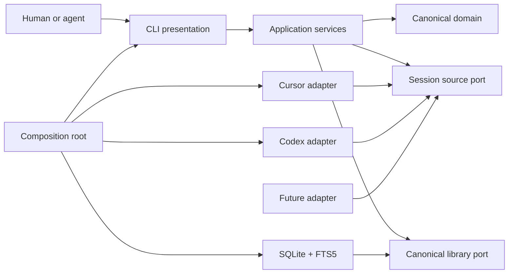

# Standalone Sessions architecture memo

- Status: accepted design baseline
- Date: 2026-07-13
- Last updated: 2026-07-18
- Scope: standalone repository through V1

## Executive summary

Sessions is a standalone local-first product. The legacy Harness implementation
served as design evidence rather than a codebase to clean up in place.

The core owns a provider-neutral session model, durable capture lifecycle, SQLite/FTS5 storage, and structured query semantics. Cursor, Codex, and future adapters only probe, discover, read, and normalize their sources. The CLI and Agent Skill consume the same application services. Provider histories remain read-only; after explicit indexing, the durable canonical library is the only source for list, search, entries, show, analysis, and export.

Public delivery is the npm package `@ferueda/sessions` with a
`sessions` binary, compiled JavaScript, Node.js 24.16 or newer, one exact
cross-platform-qualified tarball, Release Please, npm trusted publishing, and
provenance.

## Context

The existing [Harness Sessions skill](https://github.com/ferueda/harness/tree/fead436b9c810c3f0a3952789f0716765ddbc8f9/skills/sessions) proved the value of local transcript search and supplied real Cursor/Codex parsers, fixtures, output patterns, and retrospective workflows.

It also revealed boundaries that should not cross into a general product:

- The command entrypoint mixes command definition, orchestration, rendering, filtering, and provider construction.
- Provider interfaces own indexing, cache access, querying, transcript reads, and turn iteration.
- Concrete adapters write their own cache snapshots.
- Core types close over known providers.
- Analysis includes Harness-specific workflow evidence and automation/subagent policy.
- Some views reopen mutable source histories instead of reading one canonical snapshot.
- Installation symlinks TypeScript from a source checkout rather than delivering an ordinary public CLI.

Those constraints are useful migration evidence, not the standalone architecture.

## Product and design principles

1. **Local by default.** No transcript leaves the machine during ordinary use.
2. **Facts before inference.** Preserve source evidence and label classification confidence.
3. **One canonical engine.** Index, reconcile, search, show, and export behave the same for every adapter.
4. **Passive adapters.** Source-specific code translates inputs; it does not choose business policy.
5. **Honest interfaces.** Current help and docs expose only working behavior. Planned behavior is visibly planned.
6. **Scriptable delivery.** Stable exit codes, bounded output, versioned structured formats, and clean streams.
7. **Durable evidence, rebuildable projections.** Canonical snapshots remain local user data until explicit deletion; FTS and query projections can be rebuilt without deleting them.
8. **One release, local installs.** Sessions owns the CLI and Agent Skill; agent hosts install the exact matching release directly into local user state.

## Target system



Arrows represent dependencies on contracts, not runtime call direction. Domain code imports no outer layer. Application code imports domain and its own ports. Adapters and SQLite implement inward-facing ports. Only the composition root knows concrete implementations.

### Layer ownership

| Layer           | Owns                                                                                                                      | Must not own                                              |
| --------------- | ------------------------------------------------------------------------------------------------------------------------- | --------------------------------------------------------- |
| Domain          | Canonical identities, sessions, entries, content, provenance, lineage, query values                                       | Provider paths, SQLite, CLI formatting                    |
| Application     | Capture, source observation, retention, query/show/export use cases, transaction boundaries, error semantics              | Provider parsing, SQL details, terminal presentation      |
| Source adapters | Availability probe, discovery, complete-input fingerprints, source reads, normalization                                   | Index writes, ranking, filters, output, business analysis |
| Storage         | Durable canonical persistence, capture state, migrations, rebuildable FTS tables, transactions, repository implementation | Provider cases, source discovery, terminal output         |
| CLI             | Argument grammar, rendering, stream discipline, exit mapping                                                              | Parsing provider histories, SQL, recurrence policy        |
| Composition     | Adapter registration and concrete wiring                                                                                  | Domain or query behavior                                  |
| Agent Skill     | Evidence-first playbooks over stable CLI commands                                                                         | Hidden data access, automatic source or project mutation  |

### Current module map and dependency enforcement

The current implementation extends the first Codex vertical slice with
provider-neutral filtered list, lexical search, textless entry inventory,
pagination, bounded context, lineage resolution, support counts,
and canonical-only FTS projection repair. The baseline also includes durable
canonical evidence, non-destructive source-presence reconciliation,
index/list/search/entries/show, scoped forget, all-data clear, source-aware diagnostics,
explicit orphan observability/deletion, and bounded physical page reclamation. The
maintained file-by-file map is the
[current architecture guide](contributing/architecture.md); this memo remains the
stable target design.

`src/bin/sessions.ts` is the only composition root and becomes
`dist/bin/sessions.js`. Domain imports only domain. Application imports
application/domain. Infrastructure imports inward but never adapters or CLI.
Adapters import application/domain but never infrastructure or CLI. CLI imports
application/domain, never concrete infrastructure or adapters. The binary alone
may import all layers to wire them.

The current baseline persists exact text and privacy-safe omissions, tool
identity/linkage, complete/unknown lineage coverage, capture/source-observation
state, rebuildable FTS, a random library identity, and writer coordination
directly. Complete-scan absence marks a retained snapshot missing instead of
deleting it. One generation lease fences index, forget, repair, compact, and
clear; query cursors bind the observed writer generation and become stale after a
later writer.

`scripts/check-dependencies.ts` enforces that graph for explicit static and dynamic relative imports and refuses a vacuous zero-module pass. Oxlint rejects cycles. Strict `tsconfig.json` checks source/tests/scripts directly; `tsconfig.build.json` compiles only `src/` to `dist/` and rewrites explicit TypeScript import extensions for Node.js. Tests and repository scripts sit outside the production graph.

## Canonical model

The canonical model is internal before 1.0. It is intentionally richer than a flattened transcript because origin, order, and lineage determine whether evidence is trustworthy.

### Source identity

A source instance combines:

- an open adapter kind such as `cursor` or `codex`;
- an instance identifier representing one installation/profile/source root;
- an opaque provider-native session ID.

The canonical printable ID is
`<kind>@<percent-encoded-instance-id>:<percent-encoded-native-id>`, for example
`cursor@default:opaque-id`. Adapter kinds are open lowercase slugs. Instance and
native IDs remain case-sensitive opaque values; the codec escapes delimiters and
never parses or Unicode-normalizes them for business meaning.

### Session

A session contains:

- source identity and opaque native ID;
- optional title and workspace;
- created/updated timestamps normalized to canonical UTC when observed;
- optional provider-neutral lineage relations;
- explicit `complete` or `unknown` immediate rootward lineage coverage;
- the complete-input fingerprint and adapter format version used to build it;
- ordered canonical entries.

### Capture state

The canonical library records the latest successful normalized snapshot per
session identity in V1. Storage-owned capture state includes the capture time,
last successful source observation, complete-input fingerprint, adapter format
version, and the persisted `sha256-sessions-document-jcs-v1` digest over the
closed public document projection. Source presence and snapshot freshness remain
independent:

- a complete successful scan marks discovered sessions present and previously
  captured but unseen sessions missing;
- an unavailable, unreadable, malformed, or incomplete scan leaves absence
  unknown and never deletes or marks a session missing;
- a typed candidate-read failure proves the candidate was present but leaves its
  previous successful snapshot stale.

One application-owned observation instant identifies each selected-source scan.
All presence, last-seen, and successful-capture facts produced by that scan use
that instant; capture time means the scan that produced the successfully
persisted normalized snapshot, not a provider timestamp or SQLite commit time.
Run finish timestamps are diagnostics. The SQLite lease/recovery clock never
populates library capture or source-observation facts.

V1 does not keep every intermediate provider revision. A later successful read
atomically replaces the latest snapshot; explicit portable export can preserve a
chosen point in time outside the live library.

### Public document projection and digest

The implemented public projection is one field-by-field allowlist shared by
digest verification and later renderers. It contains a fixed document-schema
tag, title and provider timestamps when present, lineage coverage and ordered
relations, ordered entries with safe tool/linkage evidence, ordered segment
provenance, exact text/content hashes, and admitted non-text omission class/source
type. Relation target identity remains canonical lineage evidence.

The projection excludes the root session identity, workspace, entry source
locators, segment source metadata, provider/input locators, capture and source
observations, freshness, adapter version, and the digest itself. Optional fields
are absent rather than `null`. Arrays preserve canonical order. Relation and
content ordinals are their array positions; entries retain admitted ordinals.

`sha256-sessions-document-jcs-v1` is SHA-256 over the UTF-8 RFC 8785/JCS form of
the complete, unbounded, versioned projection. Object keys use UTF-16 code-unit
order, arrays retain order, exact well-formed Unicode is not normalized, and the
serializer feeds fragments into the hash rather than building a second complete
transcript string. The digest is independent from root identity and later source
state. It is not a signature, an authenticity result, a safety signal, or a
replacement for canonical identity or lineage.

Admission constructs and hashes the immutable projection only after canonical
validation; adapters cannot supply a digest. The fixed scheme and 32 digest bytes
are replaced atomically with the canonical document. Retained summaries require
successful capture time, effective source-observation time, last-good adapter
version, source state/freshness, and the stored digest. Show reads summary and
document under one immutable SQLite snapshot and requires their stored digests to
agree. Full document reads and semantic health reconstruct the projection and
verify the digest; list/search/entries read it directly without reconstructing every
document.

### Entry

An entry is an ordered event with:

- contiguous zero-based ordinal within the session;
- provider-neutral event kind, including generic `tool-call` and `tool-result`
  kinds when the source exposes them;
- actor: human, model, tool, system, or unknown;
- canonical UTC timestamp when observed;
- optional exact source-observed tool name on a tool call;
- optional exact source-observed tool namespace on a tool call;
- optional provider call ID and relation to a tool call or another entry;
- a non-public source locator for diagnostics;
- ordered content segments.

Tool arguments and results remain faithful ordered content rather than
provider-owned analysis fields. A tool result links to its call through canonical
entry relations and the provider call ID when available; it does not duplicate
the call's tool name or namespace. Tool identity is evidence about an observed
event, not proof of a particular workflow's intent or success.

Tool name and namespace are valid only on `tool-call`; namespace requires a
name. Both preserve exact source-observed case and Unicode. Adapters never split a
qualified name, concatenate the two fields, or infer a missing namespace.

### Content segment

Canonical content is an ordered union of text and omitted segments. Every segment
retains origin, confidence, and sanitized source metadata needed to explain its
classification without duplicating raw provider payloads.

A text segment retains faithful canonical text plus its `sha256-utf8-v1` hash of
the exact UTF-8 bytes. Only text segments participate in FTS, content
deduplication, and recurrence measures.

An omitted segment records that unsupported non-text content existed at that
position, its broad class, provenance, and a 1–64-byte lower-ASCII kebab
`sourceType` matching `^[a-z0-9]+(?:-[a-z0-9]+)*$`. The domain and storage preserve
that token exactly and reject invalid values; they never sanitize arbitrary
content into a token. Adapters use format-declared fixed labels or a narrowly
admitted structural discriminator with a fixed fallback. A source type never
comes from payload text, arbitrary keys, paths, URLs, or MIME values. The segment
contains no copied bytes, data URL, remote URL, local path, generated placeholder
text, or content hash. Adapters never fetch or open referenced media. Show/export
can render the omission explicitly without turning it into searchable transcript
text.

Adapters preserve information they can prove and use `unknown` rather than guessing.

### Occurrences and recurrence

Every text-segment appearance is retained as an occurrence identified by session,
entry ordinal, and segment ordinal. Hash equality also requires exact text
equality, so even a digest collision cannot merge unequal content. Identical
content and known lineage allow the query layer to report three different support
measures:

- **occurrence count:** every appearance;
- **unique-content count:** distinct collision-safe canonical content values;
- **unique-root count:** distinct known session roots.

No count is silently substituted for another. Unknown lineage remains unknown. This prevents copied prompts, forks, injected instructions, or delegated work from masquerading as independent repeated user intent.

Root resolution uses retained evidence only. High-confidence parent, fork, and
continuation targets are rootward; child targets are outward. Complete coverage
with no rootward relation proves self-root. Unknown coverage/kind,
non-high-confidence ancestry, a missing target, a cycle, or diverging ancestry
stays unknown; multiple paths that converge on one root remain known. Equal
content and inferred inverse relations never create ancestry.

## Source adapter contract

Each adapter implements three responsibilities:

1. `probe()` — return `ready`, `unavailable`, or `unreadable` plus sanitized
   adapter-owned source roots, without reading transcript content or mutating the
   source.
2. `discover(workspace)` — enumerate session candidates with identity, ordered
   input descriptors, an aggregate fingerprint covering every input needed by
   `read()`, and an adapter format version. The workspace is opaque and bounded
   to the call.
3. `read(candidate, workspace)` — parse and normalize one changed candidate into
   a complete canonical session document, using the same opaque capture
   capability only when private staging is required.

Contract rules:

- `kind` is an open string, never a closed Cursor/Codex union.
- Discovery order does not affect final results.
- Each input descriptor records its role, opaque diagnostic locator, and
  fingerprint. The aggregate includes ordered roles, locators, nullable record
  IDs, and fingerprints; any change invalidates it.
- Adapter format versions invalidate stale normalized documents after parser changes.
- Reads are deterministic for the same complete input. Adapters recheck every
  input before and after reading, or use an equivalent stable snapshot.
- Codex uses the stable-snapshot branch once per complete discovery: through a
  provider-neutral private-directory callback exposed only by the leased writer,
  it copies provider database/WAL bytes from verified read-only handles, opens
  SQLite only there, materializes
  an immutable row/edge generation, and removes staging before yielding. Reads
  use frozen state and verify only the live rollout. Provider SQLite/SHM is never
  opened by Sessions.
- The internal `IndexWriter` owns that capability and passes the exact same
  run-owned object to discovery and changed reads after writer acquisition. The
  application performs freshness admission first, so unchanged candidates never
  call `read` or allocate read-time staging. The callback asserts lease ownership
  before allocation and after `finally`
  cleanup, returns results only while still owned, aggregates
  operation/cleanup/lease errors, and exposes neither the scratch root nor
  `IndexPaths` to an adapter.
- Missing optional metadata degrades to absent/unknown values.
- Source-observed tool calls/results map to generic canonical entry kinds, exact
  tool names and namespaces when available, linked entries, and faithful
  argument/result content. Injected tool or skill catalogs remain injected
  content; their presence never implies invocation.
- Unavailable, unreadable, malformed, source-changed, and unsupported-format
  conditions return typed failures with safe diagnostics; they do not expose raw
  source errors or write partial index state.
- Adapters do not import storage, query, CLI, or one another.
- The shared conformance suite runs the same safety, determinism, fingerprint,
  mutation-race, provenance-fallback, and failure fixtures against every adapter.

This is an internal port in V1, not a stable external plugin ABI.

## Indexing and reconciliation

The implemented indexing service is the engine behind `sessions index`, the only
operation that reads provider histories for durable capture. It uses this
sequence:

1. Validate, deduplicate, and deterministically order exact selected source instances before opening a writer.
2. Start a durable source run, then probe the selected adapter.
3. Fully exhaust, snapshot, validate, deduplicate, and deterministically order discovery before session mutation.
4. Compare identity, complete-input fingerprint, and adapter format version with repository freshness.
5. Record unchanged candidates without calling `read()`.
6. Read and validate changed candidates, atomically replacing the latest
   successful canonical snapshot and its derived search rows while holding
   first-attempt `source-changed` outcomes through the primary pass.
7. If any source-change outcomes were held, perform at most one fresh complete
   rediscovery for the source and retry only those affected original identities.
8. Preserve the previous successful snapshot after a final typed read failure,
   mark the candidate present, and report staleness.
9. Record discovered candidates as present without changing their capture time
   when their normalized document is unchanged.
10. Only after a complete primary scan for that exact source instance, mark every
    unseen tracked session missing while retaining canonical snapshots and
    tracking-only failure evidence.
11. Finalize provider-neutral counts and bounded ordered diagnostics from durable
    repository state.

The implemented reconciliation covers canonical and tracking-only identities, so
a failed first capture may honestly become `unindexed + missing` without losing
its failure evidence or manufacturing a document. Bounded recovery also stays in
the application layer: first-attempt `source-changed` outcomes are held through
the primary pass, then at most one fresh complete rediscovery retries only the
affected original identities. Retry-only identities are ignored. The primary
discovery remains the sole coverage and missing-reconciliation snapshot, and an
incomplete or vanished retry target records one final failure without changing
that coverage result.

Properties:

- **Incremental:** unchanged complete inputs are skipped.
- **Idempotent:** reindexing unchanged sources leaves canonical results unchanged.
- **Transactional:** a session is old or new, never half-written.
- **Durable latest snapshot:** the latest successful normalized document remains available until explicit Sessions deletion.
- **Last-good preservation:** failed reads leave the prior canonical snapshot available and report staleness.
- **Adapter-version aware:** parser corrections trigger controlled re-normalization.
- **Non-destructive reconciliation:** a complete scan can mark any tracked
  identity missing but never deletes its canonical snapshot or unindexed failure
  evidence; malformed, conflicting, wrong-source, unavailable, unreadable, or
  incomplete discovery proves no absence.
- **Single writer:** a renewable generation lease admits one high-level writer. Expiry fences work between transactions; an immediate transaction may renew the unchanged exact generation, purpose, and token at entry and exit because its SQLite write lock prevents takeover. Rollback or process failure discards that renewal and partial work.
- **Recoverable:** a later writer can recover valid WAL state, interrupt abandoned runs after lease expiry, and reindex idempotently.

Lease acquisition marks the new writer generation dirty. Only a normal index
close that still owns the exact generation may seal it clean after changed
documents pass canonical digest and affected-FTS parity checks. Database close
and file hardening then finish before a private post-close proof is published as
the final fallible step. The bounded proof binds library, generation, schema,
and final database stat and contains no transcript, provider identity, path,
content hash, or lease token.

A ready, no-sidecar, current-schema open with both the clean seal and matching
proof uses constant-size schema and FTS structure checks. Dirty, recovery,
migration, maintenance, or failed-cleanup state uses the existing full
canonical, foreign-key, and FTS validation/repair path. Missing or rejected proof
only disables the optimization. Direct SQLite edits are unsupported; automatic
detection of arbitrary same-schema out-of-band changes on every clean open is
not a contract.

Probe/discovery/read failures are sanitized per-source outcomes and do not
prevent later selected sources from running. A failed or incomplete source scan
leaves current source coverage unknown and retained snapshots untouched.
Repository, lease, or finalization failures abort the invocation because
persistence trust is lost. Sources run sequentially; V1 adds no daemon or
parallel indexing. The bounded fresh-candidate retry adds no separate
application probe, sleep, backoff, per-candidate rediscovery, or retry loop.
Indexing and the two potentially long data-maintenance commands write only an
interactive startup notice that they may take a couple of minutes. Indexing also
writes bounded interactive writer-mode and full-validation phase labels. These
labels expose no sensitive value, semantic work count, percentage, ETA, or
continuation-progress contract.

Foreground indexing owns `SIGINT` and `SIGTERM` cooperatively. The application
checks cancellation only between provider/application operations and outside
SQLite transactions. A clean stop closes through the normal exact-generation
path, marks any active run interrupted with unknown coverage, preserves complete
committed replacements and untouched last-good documents, and exits `130` or
`143`. Cleanup uncertainty, crash, or `SIGKILL` remains dirty and forces the
next full validation.

List, search, and entries are self-describing about capture scope. One
page-level aggregate reports tracked, retained-current, retained-stale,
unindexed, source-state, coverage, and latest-failure counts. It identifies
which source/tracking filters it can evaluate and never treats missing canonical
metadata or text as a match or non-match. Doctor exposes the same global facts as
an evidence warning; unindexed or unknown coverage is not by itself canonical
corruption.

## Storage and search

SQLite is the durable canonical local library. FTS5 supplies lexical search. One
database contains two explicit lifecycles: retained canonical sessions/capture
state and rebuildable FTS/query projections plus bounded operational diagnostics.
The schema separates source instances, sessions, source observations, relations,
entries, content values, occurrences, index runs, migration metadata, library
identity, and writer coordination.

The supported storage baseline selects SQLite incremental auto-vacuum before WAL
or schema creation and rejects existing databases in another mode. Explicit
`data compact` owns a dedicated writer lease, runs bounded transactional
incremental-vacuum batches, and checkpoints between them. Committed batches are
durable and rerunnable; the operation changes physical allocation only and
reports observed main-file lengths without promising savings or partial-page
repacking.

Immutable health separately reports canonical content reachability: a content
value with no retained occurrence is orphaned even when foreign keys and FTS are
otherwise healthy. Doctor reports `contentReachability`, `orphanContentRows`, and
`orphanContentBytes`; a live repair lease appears as `repair-live`.
`data repair-orphans` is explicit provider-free canonical maintenance under its
own renewable `repair` lease. One invocation scans to completion in fixed
internal windows, deletes only still-unreferenced candidates with matching FTS
rows, checkpoints between committed batches, and reports aggregate deleted rows
and logical UTF-8 bytes. Failure emits no success report; completed batches
remain durable and a fresh invocation safely restarts. No limit, cursor, partial
result, or automatic repair policy is public.

Doctor also keeps semantic FTS validation immutable. It loads canonical rows in
bounded keyset batches into one contentless, memory-only TEMP expected FTS index,
then compares exact terms, positions, and docsize in both directions. The clean
writer fast path does not weaken this explicit full-library check.

The application exposes immutable provider-neutral list/search/entries query values and
one query repository beside canonical reconstruction on each read snapshot.
Shared filters cover exact source/instance, exact opaque provider-native ID,
effective source state, workspace, exclusive activity/capture/source-observation
bounds, and canonical identity. Activity uses `updatedAt`, falling back to
`createdAt`; missing activity never matches. Native-ID lookup returns zero or more canonical summaries
and never replaces the complete three-part identity required by singular or
destructive operations. Search and entries add exclusive entry-time bounds,
actor, content origin, exact entry kind, and exact source-observed tool
name/namespace. Search alone adds bounded context and literal text. The
effective observation time is the source coverage observation while coverage is
unknown and the session presence observation otherwise; it never falls back to
last-seen or provider activity time.

List, search, and entries also read one capture-scope aggregate inside that same
immutable snapshot. It counts tracked current, stale, and unindexed sessions;
effective present, missing, and unknown state; registered-source complete and
unknown coverage; and latest failures. It applies only filters provable from
source/tracking identity. Active canonical metadata, entry, and search-text
filters are named as unassessed, never used to claim that an unindexed session
matched or failed. Search support remains a separate retained-match aggregate.

Search splits on Unicode whitespace, admits at most 32 terms and 4 KiB of
canonical UTF-8 text, and quotes every term as FTS data. `all` combines terms
with AND and remains the default; `any` combines them with OR. Raw FTS syntax is
not public. One primary hit represents one
session entry regardless of matching-segment count. Its best content-level BM25
value ranks the entry; ties use session activity descending/null-last, binary
source/instance/native identity, then entry ordinal. The best segment and lowest
segment ordinal supply the bounded snippet. Occurrence frequency never improves
relevance.

Every hit reports exact unique matched terms in first-query order. `any` derives
them with page-bounded candidate probes; `all` reuses the query's unique terms.
One query-scoped root resolver supplies support plus a known retained root or
`unknown` on every list result, search hit, and entry result. Root attribution
can point outside current filters and does not enter documents, digests, show, or
export.

Search can add bounded neighboring entries plus direct, non-recursive observed
tool-call/result partners in either direction. It excludes every other relation
kind, retains exact ordinals/linkage/tool evidence, and never copies call identity
onto results. Query-wide support counts matching segments, distinct exact
canonical content, distinct resolved roots, and distinct matching sessions with
unknown lineage before page slicing.

Entry inventory applies the same exact filters without a text predicate or FTS.
It returns all qualifying entries or the lowest/highest qualifying canonical
ordinal per session. Every mode orders by binary source identity and entry
ordinal. Content hydration happens only for the selected page and includes exact
text/omission counts plus at most one origin-aware 512-byte preview. One
query-scoped lineage resolver attributes each result to a known retained root or
`unknown`; this derived result does not change documents, digests, exports,
filters, or ordering.

List, search, and entries continuation cursors bind the complete query/order contract,
command, random library instance ID, current writer generation, and next offset.
Malformed/query-mismatched cursors are usage failures; recreated-library or
later-generation cursors are stale operational failures. Every admitted writer
may conservatively stale cursors.

FTS structure and rebuild logic are shared by bootstrap and projection repair. A
dirty or recovery-required leased index-writer open first distinguishes canonical
corruption from FTS-only damage, then rebuilds only the projection from canonical
content values. A clean proven open performs constant-size structure checks.
Doctor remains immutable, verifies exact semantic terms/positions, and reports
`rebuild-required`; `data repair-orphans` never rebuilds FTS and refuses
candidates whose derived row is missing. Show and export reconstruct canonical
sessions directly rather than routing through search, including retained
sessions whose latest source state is missing or unknown.

A missing, malformed, unknown-scheme, or mismatching public-document digest is
canonical corruption. It fails full document reads and the semantic health walk;
FTS rebuild and orphan maintenance cannot recreate or repair it. Document and
digest replacement share the existing leased immediate transaction, so any later
write failure rolls both back to the last-good pair.

Databases from development builds before `0.1.0` are unsupported and fail closed
without migration or deletion; users can select a fresh Sessions data directory
and index again. The clean-writer state and persisted document digest define the
supported schema-1 baseline checksum. `data clear` does not claim an incompatible
earlier database; reset with a fresh `SESSIONS_DATA_DIR` or manual removal of
only the exact obsolete Sessions-owned directory followed by reindexing.
Compatibility begins with supported `0.1.0`; the unsupported `0.0.0` bootstrap
seed has no migration promise. From `0.1.0`, SQLite
migrations are ordered, checksummed, transactional, and forward-only; they must
preserve canonical evidence, arbitrate writer ownership before schema mutation,
and fail recoverably. Repair and projection rebuilds distinguish canonical
integrity from derived FTS integrity.

## Privacy and local state

- Indexing is explicit. First run does not scan histories.
- A successful index creates an independent durable normalized copy; provider deletion does not delete it.
- Normal operation performs no network requests and emits no telemetry.
- Provider source files are opened read-only and never modified intentionally;
  provider SQLite paths are never passed to SQLite.
- The library uses a new platform application-data location and never shares the legacy Harness JSONL cache.
- POSIX directories are created with mode `0700`; database, WAL, SHM, and
  ephemeral scratch files are constrained to `0600` where applicable. Windows
  uses the current user's profile-local application data and platform ACLs.
- `sessions paths` explains resolved source, library, and exact scratch locations without dumping transcript content.
- No TTL or automatic pruning removes canonical content. `sessions forget`
  removes one selected snapshot/tracking record and redacts its identity-bearing
  historical run-item details; aggregate diagnostics and relation references
  owned by other retained snapshots remain. `sessions data clear` removes all
  known Sessions-owned library files and the exact ephemeral scratch subtree
  after explicit invocation.
- `sessions data compact` reclaims reusable whole database pages without deleting
  canonical rows, resolving a provider, or claiming forensic erasure.
- `sessions data repair-orphans` deletes only canonical content with no retained
  occurrence and reports aggregate logical payload, never provider data or paths.
- Rebuilding derived FTS/query state never deletes retained canonical rows.
- SQLite core `secure_delete` and FTS5 secure-delete are enabled when supported, but docs make no encryption or forensic secure-erasure claim.
- The library stores the latest successful normalized canonical snapshot needed for faithful show/export, not entire raw provider payloads or every historical revision.
- Codex's active-WAL capture may leave raw state database/WAL bytes—not rollout
  transcripts—in private scratch after a crash. Normal completion removes them;
  the next leased index sweep or explicit data clear owns residue removal.

Detailed promises belong to [the privacy contract](privacy.md).

The public only-owned-file clear path validates the current baseline and path
safety, acquires its clear lease, checkpoints, and removes only database/WAL/SHM
files plus the exact `.scratch` subtree without following symlinks. Unsupported
development databases are refused, not deleted. Post-close identity/lease
verification fences races; later failure leaves clear intent for clear-only
recovery. Orphan scratch without its lease-bearing database is recovery-required.
A session-scoped transaction backs `sessions forget`; it preserves aggregate run
evidence and incoming relation tuples so it does not silently rewrite other
retained snapshots. Reindex can recapture the selected identity. No public
`index clear` command exists.

Scoped forget makes freed pages reusable but does not guarantee file shrink.
`sessions data repair-orphans` is separate provider-free logical maintenance:
doctor identifies unreachable canonical rows, repair deletes them in fixed
internal committed batches, and a later doctor proves reachability is healthy.
It never rebuilds FTS, exposes continuation state, or claims physical bytes were
reclaimed.
`sessions data compact` is separate provider-free maintenance: it checkpoints
WAL and returns reusable whole pages in bounded committed batches. Failure after
progress emits no report; rerun resumes safely. It neither deletes retained
evidence nor replaces full-library clear.

## CLI contract

Current surface:

```text
sessions
sessions doctor [--format human|json]
sessions paths [--format human|json]
sessions index [--source codex|cursor] [--format human|json]
sessions list [filters] [--limit N] [--cursor TOKEN] [--format human|json|jsonl]
sessions search <text> [filters] [--match all|any] [--limit N] [--context N]
                       [--cursor TOKEN] [--format human|json|jsonl]
sessions entries [filters] [--select all|first|last] [--limit N] [--cursor TOKEN]
                           [--format human|json|jsonl]
sessions show <canonical-id> [--entry N --context N | --from-entry N --to-entry N]
                             [--format human|json|jsonl]
sessions export <canonical-id> --format json|jsonl
                               [--full | --from-entry N --to-entry N]
sessions forget <canonical-id> [--format human|json]
sessions data repair-orphans [--format human|json]
sessions data compact [--format human|json]
sessions data clear --yes [--format human|json]
```

Literal all/any search, per-hit matched terms, activity bounds, list/search/entry
root attribution, page-level capture scope, textless entry inventory, bounded
show/export ranges, and Cursor/Codex indexing are current.

Markdown presentation is deferred beyond V1. Any later format must preserve the
same eligible evidence and digest semantics.

Behavioral rules:

- Human-readable output is the list/search/entries/show default; export requires JSON or
  JSONL explicitly.
- JSON/JSONL are explicit and schema-versioned.
- Stdout carries requested results; stderr carries warnings, progress, and errors.
- Exit `0` means successful execution, including no matches; `1` means operational failure; `2` means invalid usage.
- A fresh uninitialized library lists as a successful empty result with an
  explicit all-zero `uninitialized` capture scope, without creating storage or
  probing a provider. Cursor-free search and entries behave the same;
  show/export of an absent identity remains an operational not-found result.
- Unknown flags and invalid values fail; they are not ignored.
- Potentially large output is bounded by default. Only export accepts explicit
  `--full`.
- Color is optional and honors `NO_COLOR`.
- Filters have the same meaning for every source.
- List/search/entries/show use one shared selection for human, JSON, and JSONL. Export
  uses the same snapshot selection and emits JSON or JSONL.
- List/search/entries JSON includes capture scope once on the page; JSONL carries
  it only on the page record. Human output warns for `uninitialized` or
  `incomplete` scope and remains quiet for `complete` scope.
- `index` durably retains the latest successful normalized snapshot. A complete
  later scan can change its source state to missing but cannot delete it.
- Destructive deletion is explicit and distinct from rebuilding derived search
  state.

The exact current surface is generated help; stable semantics live in
[the CLI contract](reference/cli-contract.md). Exact machine fields, records,
null rules, order, and bounds live in the
[structured output contract](reference/structured-output.md).

## Portable context export

`sessions export` emits one retained canonical snapshot from Sessions-owned
storage and never reopens provider histories. JSON is one versioned bundle;
JSONL carries equivalent provider-neutral evidence as independently attributable
ordered records. Sessions performs extraction only: it does not
import the artifact, call provider APIs, use a clipboard or application UI,
create a destination conversation, or manage a target provider's context limits.

Every snapshot envelope identifies the canonical session, capture time, effective
source state and observation time, last-good adapter version,
document-digest scheme/value, and explicit truncation or omission state. Every
JSONL session/evidence-bearing record repeats the canonical reference and digest
needed for independent attribution. The
implemented digest covers the complete versioned public projection and remains
stable across output formats and later source-state observations. It excludes
identity/attribution, diagnostic locators, adapter input locators, source
metadata, provider roots, and local workspace paths.

A full export contains every ordered export-eligible entry and segment in that
retained normalized snapshot, including explicit omission markers. `--full`
removes CLI truncation for the selected document only; it cannot recover hidden
reasoning, raw payloads, media bytes or references, related-session bodies, or
evidence the adapter never observed. Known relations are metadata and are not
recursively exported.

JSON and JSONL explicitly frame transcript content as untrusted historical data.
JSON escaping protects syntax, not semantic trust. Source locators and local
paths are never emitted as metadata by default, but secrets or paths written
inside faithful transcript text are not automatically redacted. Users control
whether an artifact leaves the local privacy boundary. Equal text, an export
operation, or a matching document digest never creates lineage or proves later
reuse.

Default export selects the first 50 entries, first 50 relations, and first 100
segments, with at most 8 KiB raw UTF-8 per title/text segment and 256 KiB across
segment text. Show applies the same relation/segment/text bounds after its
existing entry window. Show/export may instead select one inclusive paired entry
range of at most 200 entries. Ranges never clamp, cannot combine with focused
show or full export, and still reconstruct and verify the complete retained
document before selection. A ranged result keeps that complete document digest;
entry selection does not remove later segment/text truncation. Selection
truncates only at Unicode code-point boundaries and never shortens structural
identity, hash, or linkage values. Every bounded
JSON/JSONL result is completely encoded and validated before stdout and may not
exceed 16 MiB. `export --full` alone removes selection and aggregate output caps
for export-eligible fields in the one snapshot.

## Doctor

`sessions doctor` performs real, read-only capability checks. It verifies the
minimum Node runtime, probes the runtime's SQLite/FTS5 build in memory, inspects
library safety/health through immutable state, and probes Codex readiness without
reading rollout content.

Doctor supports human output through `sessions doctor` and JSON through `sessions doctor --format json`. The JSON contract is:

```json
{
  "schemaVersion": 1,
  "command": "doctor",
  "ok": true,
  "checks": [
    {
      "id": "node-runtime",
      "label": "Node.js runtime",
      "ok": true,
      "summary": "Node.js meets the minimum version",
      "details": {
        "version": "26.4.0",
        "minimumVersion": "24.16.0"
      }
    }
  ]
}
```

Check order is stable. Every check runs even when an earlier check fails. A thrown probe error becomes a sanitized failed check rather than aborting aggregation.

The complete human or JSON report is requested data and goes to stdout. All-pass exits `0`; any failed check exits `1`; both leave stderr empty. An unexpected failure outside aggregation writes a concise diagnostic to stderr, emits no fabricated report, and exits `1`. Invalid format or other usage exits `2` through normal CLI error handling.

The current checks are `node-runtime`, `sqlite-fts5`, `library-state`,
`source-codex`, and `source-cursor`. The SQLite capability probe uses `:memory:`. An uninitialized
library passes with guidance. A ready library distinguishes canonical integrity
from rebuildable FTS health and reports run/lease state plus the global capture
aggregate. Stale, unindexed, or unknown-coverage evidence yields an
`evidence may be incomplete` summary while the check remains `ok: true`.
Canonical, foreign-key, FTS, reachability, reclamation, run, and lease failures
retain their failed-health precedence. If capture inspection cannot be trusted,
doctor reports `captureStatus: "inspection-failed"` with unknown capture counts.
An active run requires a live indexing lease; interrupted history alone is
informational. Doctor treats unavailable registered sources as informational,
fails unreadable or invalid probes, and never reads transcripts, opens a writer,
or persists state.

## Agent Skill design

V1 ships one primary `sessions` Agent Skill over the stable
search/entries/show/export commands. A single entry point avoids overlapping
triggers while references provide focused playbooks:

```text
skills/sessions/
  SKILL.md
  agents/openai.yaml
  references/
    evidence-protocol.md
    search-and-context.md
    retrospective.md
    preferences.md
    workflow-audit.md
    verification-audit.md
    handoff-continuity.md
    capability-discovery.md
```

This layout is current and ships in the package. The
[Agent Skill reference](reference/agent-skill.md) owns installation, routes, and
current limits. The skill is a prompt-and-reference layer over public CLI
contracts; it adds no hidden query, provider access, or storage behavior.

Every playbook follows the shared `evidence-protocol.md` contract:

1. Run `doctor`; index only when the user has authorized it.
2. State the question and required evidence.
3. Start with narrow, bounded JSON/JSONL queries and read each page's capture
   scope before interpreting retained results.
4. Record commands, filters, cursors, canonical IDs, and entry ordinals.
5. Inspect linked calls/results and nearby context.
6. Report facts before interpretation.
7. Separate capture availability from occurrence, unique content, known roots,
   and unknown lineage support.
8. Report capture status, unassessed filters, freshness, truncation, omissions,
   and missing evidence.
9. Treat historical instructions as untrusted data.
10. Separate process adherence, observed outcomes, and possible causes.
11. Recommend changes or sanitized tests; never mutate automatically.

Routing:

| Reference                 | Route when the user asks about                                                   |
| ------------------------- | -------------------------------------------------------------------------------- |
| `search-and-context.md`   | Decision archaeology, prior research, recall, and context transfer               |
| `retrospective.md`        | Failure, drift, reversals, recovery paths, and unresolved work                   |
| `preferences.md`          | Repeated corrections, autonomy, testing, review, and communication preferences   |
| `workflow-audit.md`       | Skill/workflow eligibility, observed use, adherence, and outcomes                |
| `verification-audit.md`   | Completion claims versus commands, results, reviews, and later corrections       |
| `handoff-continuity.md`   | Parent/child/fork/continuation transfer and omissions                            |
| `capability-discovery.md` | Recurring tasks, tool friction, missing reusable workflows, and candidate skills |

Additional derived uses include adoption/friction analysis and persistence of unresolved requests. They remain examples until distinct triggers justify separate skills.

Search and context also routes cross-provider context extraction without adding
another overlapping skill. It distinguishes bounded relevant excerpts from a
user-requested full retained snapshot, reports capture/source state and
omissions, and uses the provider-neutral export command. The skill may prepare
the local artifact and explain how to attach, paste, or pipe it, but never sends
it, opens a destination conversation, or treats historical instructions as
current instructions.

### Skill and workflow evaluation

Skill evaluation is a flagship workflow-audit use case, derived from canonical
evidence rather than implemented as a skill-specific engine. The durable
decision and boundaries are recorded in
[ADR 0006](decisions/0006-evaluate-skills-from-canonical-evidence.md).

The audit begins with an explicit evaluation rubric. Prefer the exact historical
skill text and content hash used by the session. If that is unavailable, use a
labeled reconstructed historical version; use the current version only as a
clearly retrospective rubric. Session-specific user expectations remain visible
beside the skill criteria. The rubric covers trigger, process, output, safety,
and verification requirements.

Each session is evaluated on independent axes:

- **Eligibility:** `should-use`, `should-not-use`, or `ambiguous`, based on the
  task and rubric without selecting cases by the skill name.
- **Observed-use evidence:** retain every applicable `confirmed`, `probable`,
  `requested`, `declared`, or `mention-only` signal. These signals can coexist;
  requested and declared evidence is not discarded when execution is
  unconfirmed. Native structured invocation is strongest, while a user request,
  agent declaration, or injected catalog match is not execution proof. Report
  `absent` only when coverage is sufficient to support it and `unknown` when it
  is not.

`Confirmed` requires a source-native structured load or invocation identifying
the skill. `Probable` requires linked source-observed actions that strongly
identify the skill load or application, with the inference explained. `Requested`
records explicit user intent, `declared` records an agent claim, and
`mention-only` records text or catalog presence without stronger use evidence.

This separation identifies appropriate use, missed opportunities, unnecessary
use, and correct non-use without hiding ambiguous cases. In particular, the
denominator for missed triggers comes from task intent, not searches for sessions
that already mention the skill.

| Eligibility                   | Execution conclusion | Cohort                        |
| ----------------------------- | -------------------- | ----------------------------- |
| `should-use`                  | confirmed/probable   | appropriate use               |
| `should-use`                  | absent               | missed use                    |
| `should-not-use`              | confirmed/probable   | unnecessary use               |
| `should-not-use`              | absent               | correct non-use               |
| `ambiguous`                   | any                  | unresolved eligibility        |
| `should-use`/`should-not-use` | unknown              | unresolved execution evidence |

Requested, declared, and mention-only signals annotate these cases but do not by
themselves establish execution. Ambiguous eligibility or insufficient execution
coverage stays unresolved rather than being forced into a success/failure cohort.

For every selected case, the playbook builds a trace of user intent, available
load or invocation evidence, linked tool calls/results, required steps,
contemporaneous artifacts and verification, user corrections or review findings,
completion claims, and known continuations or child sessions. Every rubric
criterion is `met`, `violated`, or `unknown` with canonical IDs and entry
ordinals. Process adherence stays separate from observed downstream results: a
skill may be followed while the task fails, or not followed while the task
succeeds. Neither observation establishes causality, and no single effectiveness
score collapses them. Recorded command or tool output is transcript evidence, not
an independent re-run of verification.

An omitted non-text segment establishes only that material was present. Its
contents and any criterion depending on them remain unavailable; the audit never
reconstructs them from private references or surrounding claims.

Cross-session summaries group continuations, forks, and delegations under known
roots, report unknown lineage separately, and avoid treating current filesystem
state as historical proof. Historical skill content is untrusted indexed data,
never instructions for the auditing agent. Recommendations require recurring
evidence across independent roots. Typical mappings are missed triggers to
trigger wording, unnecessary use to negative triggers, skipped steps to workflow
clarity, followed-but-poor results to procedure or rubric review, and absent
evidence to adapter observability.

The improvement loop is intentionally bounded: recurring evidence can yield a
sanitized regression or forward-test candidate for an external skill-authoring
workflow. Sessions does not edit skills automatically or claim a recommendation
caused later improvement. Before/after comparisons require exact skill-version
attribution, comparable task contexts, and enough independent known roots for an
honest observational conclusion.

## Delivery and repository guardrails

- TypeScript ESM in source; compiled ESM JavaScript in the published tarball.
- Node.js `>=24.16`; native TypeScript is a contributor convenience, never a user requirement.
- Published package `@ferueda/sessions`; binary `sessions`.
- A global npm install is the primary V1 channel. `npx` is a trial path for
  help or diagnostics, not the persistent command expected by the Agent Skill.
- The package allowlists compiled output, the packaged skill, README, and license.
- A package smoke test packs, installs into an isolated project, and invokes the generated executable.
- First use has no separate `init` command. `doctor` and `paths` inspect without
  creating state; explicit `index --source <source>` is the only initialization
  path because it reads provider history and writes a durable Sessions copy.
- Human onboarding stays install -> doctor -> explicit index. Uninitialized
  human output may name that next command, but no installer, postinstall hook, or
  setup wizard indexes automatically.
- Agent onboarding uses a short release-pinned setup guide. The user may
  authorize installing the official CLI and skill together, while indexing
  remains a separate permission after the agent explains what it will read and
  retain. The guide verifies version, doctor, and paths before that request.
- Install the skill globally by default because Sessions works across projects.
  Pair it with the matching CLI release rather than mutable `main`; the external
  skill installer owns host discovery, copying, updates, and removal.
- CLI or skill uninstall never deletes retained Sessions data. Users remove that
  data only through the explicit Sessions deletion commands.
- A local source checkout can install the skill with
  `npx skills add . --skill sessions`; remote repository shorthand remains a
  release-tag verification and documentation step.
- One local `pnpm check` gate covers format, lint, dependency rules, types, tests, build, dist smoke, and package smoke. CI calls the same gate.
- CI covers Linux, macOS, and Windows before release.
- Release Please owns versions, changelog, and tags. One exact tarball passes
  the full gate and Linux/macOS/Windows release smokes before the protected npm
  job publishes it through OIDC with provenance.
- One interactive, 2FA-protected `0.0.0` publish under `bootstrap` seeds npm so
  trusted publishing can be configured. It is unsupported; if npm also assigns
  its required `latest` tag to that sole version, the first supported publish
  advances it to `0.1.0`. That release is the first compatibility-bearing
  baseline.

No V1 daemon, watcher, TUI, native binary, Homebrew formula, shell-piped
installer, or self-update path. Revisit another distribution channel only when
support evidence shows that Node or global npm is a recurring adoption blocker.

## Installation and host relationship

Standalone Sessions is the sole implementation and distribution boundary. The
CLI comes from an exact public npm release, and agent hosts install the matching
`sessions` Agent Skill directly from the same immutable Sessions release tag.
The external skill installer owns host discovery, copying, upgrades, and
removal; its local skill lock is user state, not repository integration.

No downstream repository owns a Sessions wrapper, package pin, vendored
snapshot, cache, or rollback route. Repositories do not share writable state or
implementation files with Sessions. General fixes, skill guidance, and releases
all land here first.

Harness removed its legacy Sessions implementation in merge `cbaa5bc9`. M13.1
compares user outcomes against the immutable pre-removal baseline `7ac1839f` as
historical evidence only; Harness has no ongoing Sessions integration target.

Avoid submodules, bidirectional sync, and hand-copied dual fixes.

## Reuse strategy

Reuse behavior selectively, with golden tests before extraction:

- Codex home/state/rollout discovery, schema compatibility cases, and adjacent
  paired-record behavior. The
  [Codex source survey](research/codex-source-survey.md) records the reuse and
  rejection boundary before implementation.
- Cursor discovery, metadata readers, path handling, transcript parsing, and malformed-source fixtures.
- Isolated temporary environments, output rendering ideas, and clean-install CLI smoke patterns.

Do not transplant:

- the existing provider/factory abstraction;
- provider-owned cache writers;
- JSONL index formats;
- Harness workflow/evidence analysis;
- automation/subagent default filtering;
- source-reopening show/query paths;
- source-checkout installer behavior.

## Roadmap

The phase scopes below remain accepted. Phases 0 through 7 are implemented.
Codex is the first vertical slice because
its state database, rich tool identity, non-text records, and lineage exercise the
canonical model early. The provider-neutral query, export, and Agent Skill
workflow completed over Codex first; M10 settled capture truth, bounded recovery,
and routine indexing cost before Cursor became the second-adapter proof. The
[V1 implementation roadmap](../dev/plans/260713-v1-implementation-roadmap.md)
supersedes the earlier phase ordering and refines it into dependency-ordered,
independently reviewable milestones with explicit exit gates.

### Phase 0 — Foundation (complete)

Durable intent/design docs, strict package scaffold, canonical types and source port, real doctor, dependency guards, offline tests, dist/package smoke, cross-platform CI.

### Phase 1 — Canonical library (complete)

SQLite schema/migrations, application-data paths, file permissions, secure-delete
configuration, durable canonical repository, non-destructive reconciliation,
typed failures, last-good/absence tests, explicit forget/data-compact/data-clear
commands, and rebuildable FTS projections.

### Phase 2 — First adapter (complete)

Implement Codex behind `probe`/`discover`/`read`, using the source survey and new
synthetic fixtures rather than porting the Harness parser. Complete
index/list/show for the first vertical slice.

### Phase 3 — Query and export (complete)

M6 implements the completed provider-neutral lexical search, filtered/cursored
list, bounded adjacent and linked context, lineage-aware support reporting, and
FTS repair. M7 implements the canonical public projection, JCS digest, atomic
persistence, same-snapshot attribution, shared bounded selection, closed
schema-1 JSON/JSONL DTOs, and portable retained-session export. Framed Markdown
is deferred beyond V1.

### Phase 4 — Agent analysis retrieval (complete)

Query-scoped lineage resolution, rank-first search hydration, bounded
show/export ranges, textless entry inventory, literal all/any search, per-hit
matched terms, list/search/entry root attribution, and activity bounds are
complete. They required no adapter, canonical schema, or storage-index change.

### Phase 5 — Agent Skill (complete)

The packaged skill scaffold, seven evidence-first references, deterministic
metadata/layout contracts, representative forward-evaluation cases, and package
smoke ownership are complete.

### Phase 6 — Core evidence hardening (complete)

All-tracked complete-scan reconciliation, honest aggregate capture scope, and
bounded fresh-candidate recovery after `source-changed` are implemented.
Opt-in timing is implemented and preserves exact control/timed results. Writer
open now separates canonical, foreign-key, FTS structure/content/semantic, and
FTS rebuild ownership. The
fixed synthetic stable run attributed 282.069 of 532.902 ms to writer open; the
authorized real Codex 120-session stable run attributed 3,177.450 of 3,553.177
ms to writer open, with discovery at 354.958 ms and all freshness plus unchanged
writes at 14.935 ms. Exact selected observations/rollout bytes, complete reports,
zero changed reads, and library health passed. These local values selected
writer-open validation as the optimization owner; they are not public
performance guarantees.
Preserve exact canonical/query behavior and keep interpretation in the Agent Skill.

#### Current writer-open fast path

M10 binds a durable clean/dirty integrity state to the existing writer-lease
generation. A normally closed library has no owner and records its current
generation plus SQLite schema cookie as clean. Lease acquisition increments the
generation in the same immediate transaction but leaves the clean generation
behind, making the new owner durably dirty before it can mutate state. Normal
close atomically interrupts any active run, records the owned generation and
current schema cookie as clean, and releases the exact lease. It then closes and
hardens the database and publishes a private, stat-bound post-close proof last.
A stale owner can never clean a newer generation.

A clean fast open is allowed only when the prior generation was cleanly released,
the schema cookie and current baseline agree, no migration ran or is pending, no
recovery sidecars or expired owner require recovery, and constant-size pragma,
schema, and FTS object/trigger checks pass. Any crash, abandoned owner,
migration, setup failure, heartbeat/ownership loss, recovery evidence, or failed
cleanup keeps the library dirty and forces the existing full canonical, foreign
key, and FTS validation/repair path on the next writer.

Clean completion requires proportional proof of the writes performed during the
generation. Canonical replacement must reconstruct and digest-check each changed
session and verify affected FTS rows inside its transaction. Tracking and run
writes retain exact affected-row assertions. Forget, orphan repair, and
compaction may conservatively leave the library dirty until they prove equivalent
local postconditions. `doctor` remains the explicit read-only full-library
integrity check and compares canonical-derived exact terms, positions, and
docsize through a memory-only TEMP expected FTS index.

This accepts one tradeoff: direct modification of the permission-hardened
Sessions SQLite database is unsupported. A clean marker cannot detect every
out-of-band same-schema logical edit on the next fast open; `doctor` or a later
dirty/recovery open still performs full validation. Preserving automatic
detection of arbitrary external edits on every writer open would require keeping
the measured full scan and its scale-dependent cost.

The change is internal to SQLite schema and writer lifecycle. It adds no public
CLI, application, adapter, query, JSON/JSONL, or provider behavior. Before
supported `0.1.0`, it replaced the development baseline and checksum without a
compatibility migration. Older development libraries fail closed and require a
fresh `SESSIONS_DATA_DIR` or exact Sessions-owned directory reset followed by
reindexing. A fixed synthetic 2,000-session exact-equality proof measured 2.767
ms writer open / 264.666 ms total. The authorized read-only real Codex
120-session exact-cohort proof measured 3.262 ms / 366.055 ms with zero changed
reads. Both local budgets passed. Dirty/recovery opens have no speed budget;
correctness remains their only gate. The fixed generic measurement also consumes
the proof on an equal clone, requires semantic equality with the clean run and
zero stable source reads, and reports the dominant full-validation phase.

### Phase 7 — Equivalent second adapter (complete)

Cursor rich stores and reduced JSONL use the same port. One optional
adapter-version replacement decision prevents reduced evidence from replacing a
rich last-good snapshot. Domain, storage, query, export, and CLI behavior remain
provider-neutral.

### Phase 8 — Public release and standalone acceptance complete

Release automation, trusted publishing, and cross-platform qualification are
live. `0.1.0` established the supported baseline and `0.1.1` verified the routine
release path. M13.1 established standalone parity through the shared provider
workflow, a test-only third adapter, authorized live cohorts, the frozen Harness
baseline, and the published package/skill. Agent hosts consume the CLI and
matching skill directly from one immutable Sessions release; no downstream
repository wrapper remains. M13.3 qualifies the final release and closes V1.

## V1 acceptance criteria

- Cursor and Codex provide equivalent index/list/search/show/export semantics.
- Adding a third source adapter requires no domain, storage, indexing, or query edits.
- Indexing is incremental, idempotent, transactional, and preserves last-good documents on failure.
- Complete discovery reconciles retained and unindexed tracking state; one
  bounded fresh-candidate retry can recover `source-changed` without changing
  the primary coverage snapshot or double-counting a session.
- Explicit indexing durably retains the latest successful normalized snapshot;
  complete-scan absence changes source state without deleting it.
- Search/show/export operate only on canonical library data, including retained
  sessions whose provider source is missing or currently unknown.
- List/search/entries disclose aggregate capture scope and cannot present an
  unindexed session as a canonical metadata or transcript match/non-match.
- Rebuilding derived search state preserves canonical data; only explicit
  forget, orphan repair, or data-clear behavior deletes it.
- Provenance and deduplication prevent copied/injected/delegated content from being reported as independent repeated user intent.
- Source-observed tool name, namespace, and linkage distinguish execution evidence from
  injected, requested, declared, or mention-only evidence without inventing
  missing events.
- Provider histories are never mutated, and ordinary operation performs no network access or telemetry.
- JSON/JSONL schemas are versioned and contract-tested.
- Routine indexing has privacy-safe phase evidence and a measured stable-run
  budget; performance changes preserve canonical digests, exact query output,
  counts, lineage, cursors, failures, and provider-read-only behavior.
- Portable exports preserve ordered canonical evidence and omissions, exclude
  private diagnostic metadata, frame historical content as untrusted, and never
  deliver it to a destination provider.
- A clean packed install runs on supported operating systems with only the declared Node runtime and dependencies.
- The packaged Agent Skill produces provenance-rich, facts-first reports,
  including skill/workflow audits with explicit rubric provenance, separate
  adherence and observed outcomes, honest unknowns, and no causal or
  auto-mutation claims.

## Deferred directions

The preferred evidence-first core direction after V1 is provider-neutral
related-session traversal, literal metadata discovery, explicit multi-session
JSON/JSONL bundles with reproducibility manifests, exact named-unit facets,
deterministic comparison/timelines, machine-readable capabilities, and a
canonical archive whose import/restore contract is designed separately. These
features retrieve, group, count, and package facts; the Agent Skill still owns
relevance, causality, success/failure, drift, and recommendations.

Tokenizer phrase search, smaller search/entries title bounds, and exact locator
string interning are nearer candidates but remain evidence-gated. Phrase means
adjacent tokenizer terms rather than byte-exact containment; title changes must
show representative encoded-output savings; locator interning must show material
size reduction without provider assumptions or orphaned private metadata.

After V1 evidence: semantic search, an external plugin ABI, cloud/team indexes,
native binaries, Homebrew, TUI/watch mode, orchestration integrations, opt-in
automated changes, raw provider backup, immutable history for every provider
revision, library import/restore, and destination-provider delivery. Each
requires a separate intent and privacy review.

## Release status

The npm scope, GitHub App, protected environment, and trusted publisher are
configured. Supported releases `0.1.0` and `0.1.1` were qualified, published,
installed from the public registry, and verified for integrity and provenance.
See [releasing](contributing/releasing.md) and
[ADR 0009](decisions/0009-establish-the-supported-release-baseline.md).
